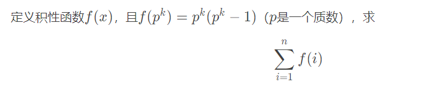

​																


​												Template For ICPC
​																								——lovekdl


<div STYLE="page-break-after: always;"></div>


FFT

```c++
#include<bits/stdc++.h>
using namespace std;
#define rint register int
#define ll long long
#define rll register long long
#define db long double
const int N=1<<21;
const db pi=acosl(-1);
struct cp{
    db x,y;
    cp operator + (const cp&A)const{return (cp){x+A.x,y+A.y};}
    cp operator - (const cp&A)const{return (cp){x-A.x,y-A.y};}
    cp operator * (const cp&A)const{return (cp){x*A.x-y*A.y,x*A.y+y*A.x};}
    cp operator / (const db&A)const{return (cp){x/A,y/A};}
}w[N],t;
int r[N],pd;
void fft(rint n,vector<cp> &a,rint typ){
	if(pd!=n){
		for(rint i=0;i<n;i++)
			r[i]=(r[i>>1]>>1)|((i&1)?n>>1:0);
		pd=n;
	}
	a.resize(n);
	for(rint i=0;i<n;i++)
		if(i<r[i])swap(a[i],a[r[i]]);
	for(rint mid=1;mid<n;mid<<=1)
	for(rint i=0;i<n;i+=mid<<1)
	for(rint j=0;j<mid;j++)
		t=w[mid+j]*a[i+j+mid],a[i+j+mid]=a[i+j]-t,a[i+j]=a[i+j]+t;
	if(~typ)return ;
	reverse(a.begin()+1,a.end());
	for(rint i=0;i<n;i++)
		a[i]=a[i]/n;
}
void init(){
	w[N/2]=(cp){1.0,0.0};w[N/2+1]=t=(cp){cosl(2*pi/N),sinl(2*pi/N)};
	for(rint i=N/2+2;i<N;i++)w[i]=w[i-1]*t;
	for(rint i=N/2-1;i;i--)w[i]=w[i<<1];
}
vector<cp> Mul(vector<cp> a,vector<cp> b){
    int n=1;
    while(n<=a.size()+b.size())n<<=1;
    fft(n,a,1);fft(n,b,1);
    for(rint i=0;i<n;i++)
        a[i]=a[i]*b[i];
    fft(n,a,-1);
    return a;
}
inline int read(){
    int x=0,f=1;char ch=getchar();
    while(ch<'0'||ch>'9'){if(ch=='-')f=-1;ch=getchar();}
    while(ch<='9'&&ch>='0'){x=x*10+ch-'0';ch=getchar();}
    return x*f;
}
int main(){
    init();
	rint n=read(),m=read();
    ++n;++m;
	vector<cp> f,g;
	f.resize(n);g.resize(m);
	for(rint i=0;i<n;i++)
        f[i].x=read();
    for(rint i=0;i<m;i++)
        g[i].x=read();
    f=Mul(f,g);
	for(rint i=0;i<n+m-1;i++)
		printf("%d ",int(f[i].x+0.3));
	return 0;
}
```

<div STYLE="page-break-after: always;"></div>


多项式

```C++
#include<bits/stdc++.h>
#define int long long
using namespace std;
const int N = 3e5+10;
const int mod = 998244353, g = 3, gi = 332748118;
//const int mod = 4179340454199820289, g = 3, gi = 1393113484733273430;
int n, m;
int a[N], b[N];
int re[N];


int ksm(int a, int b) {
	int ret = 1;
	while(b) {
		if(b & 1) ret = ret * a %mod;
		a = a * a % mod;
		b >>= 1;
	}
	return ret;
}
int inv(int x) {
	return ksm(x, mod - 2);
}

void ntt(int *a, int lim, int opt) {
	for(int i = 0; i < lim; ++i) 
		if(i < re[i]) swap(a[i], a[re[i]]);
	for(int len = 1; len < lim; len <<= 1) {
		int wn = ksm(opt == 1 ? g : gi, (mod - 1) / (len << 1));
		for(int i = 0; i < lim; i += (len << 1)) {
			int w = 1;
			for(int j = 0; j < len; ++j) {
				int x = a[i + j], y = w * a[i + j + len] % mod;
				a[i + j] = (x + y) % mod;
				a[i + j + len] = (x - y + mod) % mod;
				w = w * wn % mod;
			}
		}
	}
	if(opt == 1) return;
	int limv = inv(lim);
	for(int i = 0; i < lim; ++i) {
		a[i] = a[i] * limv % mod;
	}
}

//n次多项式和m次多项式卷积
void mul(int *F,int n, int *G, int m) {
//	if(n+m < 128) {
//		for(int i = 0; i <= n + m; ++i) {
//			H[i] = 0;
//		}
//		for(int i = 0; i <= n; ++i) {
//			for(int j = 0; j <= m; ++j) {
//				H[i+j] = (H[i+j] + F[i] * G[j] % mod) % mod;
//			}
//			F[i] = H[i];
//		}
//		for(int i = n + 1; i <= n + m; ++i) {
//			F[i] = H[i];
//		}
//		return;
//	}
	int lim = 1, ti = 0;
	while(lim <= n + m) {
		lim <<= 1;
		ti++;
	}
	for(int i = n + 1; i < lim; ++i) F[i] = 0;
	for(int j = m + 1; j < lim; ++j) G[j] = 0;
	for(int i = 0; i < lim; ++i) {
		re[i] = (re[i >> 1] >> 1) | ((i & 1) << (ti - 1));
	}
	ntt(F, lim, 1);
	ntt(G, lim, 1);
	for(int i = 0; i < lim; ++i) {
		F[i] = F[i] * G[i] % mod;
	}
	ntt(F, lim, -1);
	for(int i = n + m + 1; i < lim; ++i) assert(F[i] == 0);
}

//n-1次多项式求逆

int H[N];
void inv(int *F, int *G, int n) { 
	if(n == 1) {G[0] = inv(F[0]);return;}
	inv(F, G, (n+1)>>1);
	int ti = 0, lim = 1;
	while(lim < n<<1) {
		lim <<= 1;
		ti++;
	}
	for(int i = 1; i < lim; ++i) {
		re[i] = (re[i >> 1] >> 1) | ((i & 1) << (ti - 1));
	}
	for(int i = 0; i < n; ++i) H[i] = F[i];
	for(int i = n; i < lim; ++i) H[i] = G[i] = 0;
	ntt(H, lim, 1);
	ntt(G, lim, 1);
	for(int i = 0; i < lim; ++i) {
		G[i] = G[i]*(2ll-H[i]*G[i] % mod + mod) % mod;
	}
	ntt(G, lim, -1);
	for(int i = n; i < lim; ++i) G[i] = 0;
}
//求导, F->G 
void diff(int *F, int *G, int n) {
	for(int i = 1; i < n; ++i) G[i-1] = F[i] * i % mod;
	G[n-1] = 0;
}
//积分, F->G 
void integral(int *F, int *G, int n)  {
	for(int i = 1; i < n; ++i) G[i] = F[i - 1] * inv(i) % mod;
	G[0] = 0;
}

//多项式ln
int Fi[N], Fd[N];
void ln(int *F, int *G, int n) {
	for(int i = 0; i < (n<<2); ++i) G[i] = 0;
	inv(F, Fi, n);
	diff(F, Fd, n);
	mul(Fi, n-1, Fd, n-1);
	integral(Fi, G, n);
}
//多项式exp
int lnG[N]; 
void exp(int *F, int *G, int n) {
	if(n == 1) {G[0] = 1;return;}
	exp(F, G, n + 1 >> 1);
	assert(G[0] == 1);
	ln(G, lnG, n);
	assert(lnG[0] == 0);
	for(int i = 0; i < n; ++i) lnG[i] = (F[i] - lnG[i] + mod) % mod;
	
	lnG[0]++;lnG[0] %= mod;
	mul(G, n - 1, lnG, n - 1);
}

int G2[N], GG[N], G2i[N];
void sqrt(int *F, int *G, int n){
	if(n == 1){
		G[0] = 1;
		return;
	}
	
	sqrt(F, G, n + 1 >> 1);
	for(int i = 0; i < n; ++i) {
		G2[i] = G[i] * 2 % mod;
		GG[i] = G[i];
		G2i[i] = 0;
	}
	inv(G2, G2i, n);
	
	mul(G, n - 1, GG, n - 1);
	for(int i = 0; i < n; ++i) {
		G[i] = (G[i] + F[i]) % mod;
	}
	mul(G, n - 1, G2i, n - 1);
	return;
}

void solve() {

	// int x, y;
	// cin>>x>>y;
	// for(int i = 0; i <= x; ++i) {
	// 	cin>>a[i];
	// }
	// for(int i = 0; i <= y; ++i) {
	// 	cin>>b[i];
	// }
	// mul(a, x, b, y);
	// for(int i = 0; i <= x + y; ++i) {
	// 	cout<<a[i]<<" ";
	// }

	// int n;
	// cin>>n;
	// for(int i = 0 ; i < n; ++i) {
	// 	cin>>a[i];
	// }
	// inv(a, b, n);
	// for(int i = 0; i < n; ++i) {
	// 	cout<<b[i]<<" ";
	// }


	
	// int n;
	// cin>>n;
	// for(int i = 0; i < n; ++i) {
	// 	cin>>a[i];
	// }
	// ln(a, b, n);
	// for(int i =0; i < n; ++i) {
	// 	cout<<b[i]<<" ";
	// }

	// int n;
	// cin>>n;
	// for(int i = 0; i < n; ++i) {
	// 	cin>>a[i];
	// }
	// exp(a, b, n);
	// for(int i = 0; i < n; ++i) {
	// 	cout<<b[i]<<" ";
	// }

	int n;
	cin>>n;
	for(int i = 0; i < n; ++i) {
		cin>>a[i];
	}
	int sum = 1;
	while(sum <= n) sum <<= 1;
	sqrt(a, b, sum);
	for(int i = 0; i < n; ++i) {
		cout<<b[i]<<" ";
	}
}


signed main() {
	ios::sync_with_stdio(false);
	cin.tie(nullptr);
	solve();
	return 0;
}
```

<div STYLE="page-break-after: always;"></div>

分治NTT

```c++
/*
分治ntt
计算f[i] = sum(f[i-j] * g[j])
*/

#include <bits/stdc++.h>
using namespace std;
#define int long long
const int maxn = 2e6+10;
const int mod = 998244353,G = 3,Gi = (mod+1)/3;
int r[maxn], a[maxn], b[maxn], f[maxn], g[maxn],n;
int qpow(int a, int b) {
	int ret = 1;
	while(b) {
		if(b & 1) ret = ret * a % mod;
		a = a * a % mod;
		b >>= 1;
	}
	return ret;
}
void NTT(int *a,int limit,int type) {
	for(int i = 0; i < limit; i++)	
		if(i < r[i]) swap(a[i], a[r[i]]);
	for(int mid = 1; mid < limit; mid <<= 1) {
		int wn = qpow((type == 1 ? G : Gi), (mod - 1) / (mid << 1));
		for(int R = mid << 1, i = 0; i < limit; i += R)
		for(int k = 0, w = 1; k < mid; k++, w = w * wn % mod) {
			int x = a[i+k], y = a[i+k+mid] * w % mod;
			a[i+k] = (x + y) % mod, a[i+k+mid] = (x - y + mod) % mod;
		}
	}
	if(type == 1)	return;
	int inv = qpow(limit, mod-2);
	for(int i = 0;i < limit; i++)	a[i] = a[i] * inv % mod;
}
void mul(int *a, int *b, int limit) {
	for(int i = 0; i < limit; i++)	
		r[i] = (r[i >> 1] >> 1) | ((i & 1) ? limit >> 1 : 0 );
	NTT(a, limit, 1); NTT(b, limit, 1);
	for(int i = 0; i < limit; i++)	a[i] = a[i] * b[i] % mod;
	NTT(a, limit, -1);
}
void solve(int l, int r) {
	if(l == r) return;
	int mid = l + r >> 1; 
	solve(l, mid);
	int limit = 1;
	while(limit <= mid - l + r - l)	limit <<= 1;
	for(int i = 0; i < limit; i++)	a[i] = b[i] = 0;
	for(int i = l; i <= mid; i++)	a[i - l] = f[i];
	for(int i = 1; i <= r - l; i++)	b[i] = g[i];
	mul(a, b, limit);
	for(int i = mid + 1; i <= r; i++)	f[i] = (f[i] + a[i - l])%mod;
	solve(mid+1 , r);
}
signed main() {
	cin >> n;
	for(int i = 1; i < n; i++)	scanf("%lld", &g[i]);
	f[0] = 1;
	solve(0, n-1);
	for(int i = 0; i < n; i++)	printf("%lld ", f[i]);
}
```

<div STYLE="page-break-after: always;"></div>

拉格朗日插值


```c++
#include<bits/stdc++.h>
#define int long long
using namespace std;
const int N = 1e4+10;
const int mod = 998244353;
int T;
int n, k;
int x[N], y[N];

int qpow(int a, int b) {
	int ret = 1;
	while(b) {
		if(b & 1) ret = ret * a % mod;
		a = a * a % mod;
		b >>= 1;
	}
	return ret;
}

int lagrange(int k) {
	int ans = 0;
	for(int i = 1; i <= n; ++i) {
		int now = y[i];
		for(int j = 1; j <= n; ++j) {
			if(j == i) continue;
			now = now * (k - x[j]) % mod * qpow(x[i] - x[j], mod - 2) %mod;
		}
		ans = (ans + now) % mod;
	}
	if(ans < 0) ans += mod;
	return ans;
}
```

<div STYLE="page-break-after: always;"></div>

exgcd

```c++
int exgcd(int a, int b, int &x, int &y) {
    if (b == 0) {
        x = 1;
        y = 0;
        return a;
    }
    int d = exgcd(b, a % b, y, x);
    y -= (a / b) * x;
    return d;
}
```

合并两个同余方程(CRT)

```c++
//x = a mod b
//x = c mod d
void merge(ll &a, ll &b, ll c, ll d) { 
    if (a == -1 && b == -1) return;
    ll x, y;
    ll g = exgcd(b, d, x, y);
    if ((c - a) % g != 0) {
        a = b = -1;
        return;
    }
    d /= g;
    ll t0 = ((c - a) / g) % d * x % d;
    if (t0 < 0) t0 += d;
    a = b * t0 + a;
    b = b * d;
}
```

<div STYLE="page-break-after: always;"></div>

莫比乌斯反演
$$
f[n] = {∑_{d|n}}g(d) 求g(n)
$$


```c++
#include<bits/stdc++.h>
#define uint unsigned int 
using namespace std;
typedef long long ll;
const int N = 1e6+101;
uint f[N];
int n;
int p[N], pr[N], pe[N];
int cnt;
uint mu[N];
uint g[N];
unsigned int A,B,C;
void solve() {
	scanf("%d", &n);
    for (int i = 1; i <= n; i++)
        cin>>f[i];
    p[1] = 1;mu[1] = 1;
    for(int i = 2; i <= n; ++i) {
    	if(!p[i]) {
    		p[i] = i;
    		pr[++cnt] = i;
    		mu[i] = (uint)-1;
    	}
    	for(int j = 1; j <= cnt && i * pr[j] <= n; ++j) {
    		p[i * pr[j]] = pr[j];
    		if(p[i] == pr[j]) {
    			mu[i * pr[j]] = 0;
    			break;
    		}
    		else mu[i * pr[j]] = (uint) -mu[i];
    	}
    }
    for(int d1 = 1; d1 <= n; ++d1) 
    	for(int d2 = 1; d2 * d1 <= n; ++d2) 
    		g[d1 * d2] += f[d1] * mu[d2];
}
int main() {
	solve();
	return 0;
}
```


<div STYLE="page-break-after: always;"></div>

求积性函数

```c++
void compute(function<void(int)> calc) {
	f[1] = 1;
	uint ans = 0;
	for(int i = 2; i <= n; ++i) {
		if(i == pe[i]) calc(i);
		else f[i] = f[i / pe[i]] * f[pe[i]];
		ans = ans ^ (a * i * f[i] + b);
	}
	ans = ans ^ (a + b);
	printf("%u\n", ans);
}

void solve() {
	scanf("%d%u%u", &n, &a, &b);
	for(int i = 2; i <= n; ++i) {
		if(!p[i]) {
			p[i] = i;
			pe[i] = i;
			pr[++cnt] = i;
		}
		for(int j = 1; j <= cnt && i * pr[j] <= n; ++j) {
			p[i * pr[j]] = pr[j];
			if(p[i] == pr[j]) {
				pe[i * pr[j]] = pe[i] * pr[j];
				break;
			}
			else {
				pe[i * pr[j]] = pr[j];
			}
		}
}    
```

<div STYLE="page-break-after: always;"></div>

O($\sqrt{n}$)求$\sum_{i=1}^n{gcd(i,n)}$
积性函数，$g(p^a) = (a+1)p^a - ap^{a-1}$

```c++
#include<bits/stdc++.h>
#define int long long
using namespace std;
int g(int n){
	int ans = 1;
	for(int i=2;i*i<=n;++i){
		if(n%i) continue;
        int a=0;
        int p=1;
        while(n%i==0) {
            p *= i;
            ++a;
            n /= i;
        }
        ans *= (a+1)*p - p/i*a;
	}
	if(n>1){
		ans *= n+n-1;
	}
	return ans;
}

signed main(){
	int n;
	cin >> n;
	cout << g(n) << endl;
	return 0;
}
```

<div STYLE="page-break-after: always;"></div>

Pollard rho

```C++
#include<bits/stdc++.h>
#define int long long
using namespace std;

typedef __int128 i128;
const int N = 1010;
int n;
int ans[N], tot;

int randint(int l, int r) {
	static mt19937 Rand(time(NULL));
	uniform_int_distribution<int> dis(l, r);
	return dis(Rand); 
}

int ksm(int a, int b, int p) {
	int ret = 1;
	while(b) {
		if(b & 1) ret = (i128) ret * a % p;
		a = (i128) a * a % p;
		b >>= 1;
	}
	return ret;
}

bool miller_rabin(int n) {
	if(n < 3 || n % 2 == 0) return n == 2;
	int a = n - 1, b = 0;
	while(a % 2 == 0) {
		a /= 2;
		b++;
	}
	for(int i = 1, j; i <= 10; ++i) {
		int x = randint(2, n - 1);
		int v = ksm(x, a, n);
		if(v == 1) continue;
		
		for(j = 0; j < b; ++j) { //ûÓÐint 
			if(v == n - 1) break;
			v = (i128)v * v % n;
		}
		if(j == b) return 0;
	}
	return 1;
}

int pollard_rho(int n) {
	int s = 0, t = 0;
	int c = randint(1, n - 1);
	int step = 0, goal = 1;
	int value = 1;
	auto f = [&](int x) {
		return ((i128)x*x+c)%n;
	};
	for(goal = 1; ; goal <<= 1, s = t, value = 1) {
		for(step = 1; step <= goal; step++) {
			t = f(t);
			value = ((i128)value * abs(t - s)) % n;
			if(step % 127 == 0) {
				int d = __gcd(value, n);
				if(d > 1) return d;
			}
		}
		int d = __gcd(value, n);
		if(d > 1) return d;
	}
	return 0;
}

void get_fac(int n) {
	if(n == 1) return;
	if(miller_rabin(n)) {
		ans[++tot] = n;
		return;
	}
	int p = n;
	while(p == n) p = pollard_rho(n);
	while((n % p) == 0) n /= p;
	get_fac(n);
	get_fac(p);
}

void solve() {
	cin>>n;
	tot = 0;
	get_fac(n);
	
	sort(ans + 1, ans + 1 + tot);
	tot = unique(ans + 1, ans + 1 + tot) - ans - 1;
	if(ans[tot] == n) cout<<"Prime\n";
	else cout<<ans[tot]<<"\n";
}

signed main() {
	ios::sync_with_stdio(false);
	cin.tie(nullptr);
	
	int t = 1;
	cin>>t;
	while(t--) {
		solve();
	}
	
	return 0;
} 
```

<div STYLE="page-break-after: always;"></div>

tarjan缩点

```c++
#include<bits/stdc++.h>
#define int long long 
using namespace std;
const int maxn = 1e5+100;
int n, m;
int num, ans;
int w[maxn];
int dfn[maxn], low[maxn], vis[maxn];
int belong[maxn], in[maxn], f[maxn];
struct Edge {
	int next[maxn], to[maxn], from[maxn];
	int head[maxn], cnt;
	void con(int u, int v) {
		next[++cnt] = head[u];
		to[cnt] = v;
		from[cnt] = u;
		head[u] = cnt;
	}
}ED1, ED2;
stack <int> stu;
void tarjan(int x) {
	low[x] = dfn[x] = ++num;
	vis[x] = 1;
	stu.push(x);
	for(int i = ED1.head[x]; i; i = ED1.next[i]) {
		int v = ED1.to[i];
		if(!dfn[v]) {
			tarjan(v);
			low[x] = min(low[x], low[v]);
		}
		if(vis[v])
			low[x] = min(low[x], low[v]);
	}
	if(dfn[x] == low[x]) {
		while(stu.top() != x) {
			int y = stu.top();
			stu.pop();
			belong[y] = x;
			w[x] += w[y];
			vis[y] = 0;
		}
		belong[x] = x;
		vis[x] = 0;
		stu.pop();
	}
}
signed main() {
	cin>>n>>m;
	for(int i = 1; i <= n; ++i)
		scanf("%lld", &w[i]);
	for(int i = 1; i <= m; ++i) {
		int u, v;
		scanf("%lld%lld", &u, &v);
		ED1.con(u, v);
	}
	for(int i = 1; i <= n; ++i) {
		if(!dfn[i]) tarjan(i);
	}
	for(int i = 1; i <= m; ++i) {
		int u = belong[ED1.from[i]], v = belong[ED1.to[i]];
		if(u == v) continue;
		++in[v];
		ED2.con(u, v);
	}
    //topo
	return 0;
}
```

<div STYLE="page-break-after: always;"></div>

线性基

```c++
#include<bits/stdc++.h>
using namespace std;
#define int long long
const int maxn = 2e5 + 10;

const int B = 60;


struct LinearBasis {
    vector<int> a = vector<int>(B, 0);

    
    bool insert(int x) {    
        for(int i = B - 1; i >= 0; i--) {
            if(x & (1LL << i)) {
                if(a[i] == 0) { a[i] = x; return true; }
                x ^= a[i];
            }
        }
        return false;
    }


    int queryMin(int x) {
        for(int i = B - 1; i >= 0; i--) {
            x = min(x, x ^ a[i]);
        }
        return x;
    }
    int queryMax(int x) {
        for(int i = B - 1; i >= 0; i--) {
            x = max(x, x ^ a[i]);
        }
        return x;
    }
};

void work() {
    int n, k;
    cin >> n >> k;

    vector<int> a(n + 1);
    for(int i = 1; i <= n; i++) cin >> a[i];

    LinearBasis b;
    int cnt0 = 0;
    for(int i = 1; i <= n; i++) {
        if(!b.insert(a[i])) {
            cnt0++;
        }
    }

    // 为什么是向下取整呢？因为有第0小的数，所以是向下取整
    k = k / (1LL << cnt0);
    // k >>= cnt0;

    int ans = 0;
    int cnt = 0;
    for(int i = 0; i < B; i++) {
        if(b.a[i] == 0) continue;
        cnt++;
    }
    cnt--;
    for(int i = B - 1; i >= 0; i--) {
        if(b.a[i] == 0) continue;
        if(k >= (1LL << cnt)) {
            k -= 1LL << cnt;
            ans = max(ans, ans ^ b.a[i]);
        } else {
            ans = min(ans, ans ^ b.a[i]);
        }
        cnt--;
    }

    cout << ans << endl;

}

signed main() {
    ios::sync_with_stdio(0);
    cin.tie(0);
    
    int t = 1;
    // cin >> t;
    while(t--) {
        work();
    }
    
    return 0;
}
```


<div STYLE="page-break-after: always;"></div>

虚树

```c++
#include<bits/stdc++.h>
#define int long long
#define PII pair<int, int>
using namespace std;
const int N = 3e5 + 1010;
const int inf = 1ll<< 60;
int n, m, k;
int x[N],tot;
int w[N], va[N], dep[N], minp[N], dfn[N], cnt;
int lc[N][19];
vector<PII> e[N];
vector<int> e1[N];

void dfs1(int x, int fa) {
	dfn[x] = ++tot;
	dep[x] = dep[fa] + 1;
	lc[x][0] = fa;
	for(auto t : e[x]) {
		int v = t.first;
		if(v == fa) continue;
		minp[v] = min(minp[x], t.second);
		dfs1(v, x);
	}
}
bool cmp(int a, int b) {
	return dfn[a] < dfn[b];
}
int lca(int x, int y) {
	int flag = 0;
	if(x == 8 && y == 3) {
		flag = 1;
	}
	if(dep[x] < dep[y]) swap(x, y);
	for(int j = 18; j >= 0; --j) {
		if(dep[lc[x][j]] >= dep[y]) {
			x = lc[x][j];
		}
	}
	
	if(x == y) return x;
	for(int j = 18; j >= 0; --j) {
		if(lc[x][j] == lc[y][j]) continue;
		x = lc[x][j];
		y = lc[y][j];
	}
	return lc[x][0];
}
void con(int x, int y) {
	e1[x].push_back(y);
	e1[y].push_back(x);
}
int stac[N], top = 0;
//建树
void build() {
	sort(w + 1, w + 1 + k, cmp);
	top = 0;
	stac[++top] = w[1];
	for(int i = 2; i <= k; ++i) {
		int lc = lca(stac[top], w[i]);
		while(dep[stac[top - 1]] >= dep[lc])	 {
			con(stac[top], stac[top - 1]);
			top--;
		}
		if(stac[top] != lc) {
			con(lc, stac[top]);
			stac[top] = lc;
		}
		stac[++top] = w[i];
	}
	for(int i = top; i >= 2; --i) {
		con(stac[i], stac[i - 1]);
	}
}
//dp
int dfs(int x, int fa) {
	int now = 0;
	for(auto v : e1[x]) {
		if(v == fa) continue;
		now += dfs(v, x);
	}
	//记得清除虚树
	e1[x].clear();
	if(va[x]) {
		va[x] = 0;
		return minp[x];
	}
	else return min(now, minp[x]);
}
void solve() {
	cin>>n;
	for(int i = 1, u, v, d; i < n; ++i) {
		cin>>u>>v>>d;
		e[u].push_back({v, d});
		e[v].push_back({u, d});
	}

	for(int i = 1; i <= n; ++i) minp[i] = inf;
	minp[1] = inf;
	dfs1(1, 0);
	for(int j = 1; j <= 18; ++j) {
		for(int i = 1; i <= n; ++i) {
			lc[i][j] = lc[lc[i][j-1]][j-1];
		}
	}
	cin>>m;
	for(int i = 1; i <= m; ++i) {
		cin>>k;
		for(int i = 1; i <= k; ++i) {
			cin>>w[i];
			va[w[i]] = 1;
		}
		build();
		cout<<dfs(stac[1], 0)<<endl;
	}
}

signed main() {
	ios::sync_with_stdio(false);
	cin.tie(nullptr);

	solve();
	return 0;
}
```

<div STYLE="page-break-after: always;"></div>

LCT维护最大生成树(边的消失时间)


```C++
#include<bits/stdc++.h>
#define int long long 
using namespace std;

const int N = 5e5 + 1010;
const int inf = 1ll << 60;
int n, m, k;
int a[N];
int stac[N];

vector<int> in[N];
vector<int> out[N];
int mark[N];
struct ED {
	int u, v, l, r;
}edge[N];

struct node{
	int son[2], fa, val, sum;
	int st;
	int mint, minid;
	int flag;
}t[N]; 

void update(int x) {
	//t[x].sum = t[t[x].son[0]].sum ^ t[t[x].son[1]].sum ^ t[x].val;
	t[x].sum = t[t[x].son[0]].sum + t[t[x].son[1]].sum + t[x].val;
	t[x].mint = t[x].st;
	t[x].minid = x;
	if(t[x].son[0] && t[t[x].son[0]].mint < t[x].mint) {
		t[x].mint = t[t[x].son[0]].mint;		
		t[x].minid = t[t[x].son[0]].minid;
	}
	if(t[x].son[1] && t[t[x].son[1]].mint < t[x].mint) {
		t[x].mint = t[t[x].son[1]].mint;		
		t[x].minid = t[t[x].son[1]].minid;
	}
}

void lazy(int x) {
	swap(t[x].son[0], t[x].son[1]);
	t[x].flag ^= 1;
}

void pushdown(int x) {
	if(!t[x].flag) return;
	lazy(t[x].son[0]);
	lazy(t[x].son[1]);
	t[x].flag = 0;
}

bool isroot(int x) {
	return (t[t[x].fa].son[0] != x && t[t[x].fa].son[1] != x);
}

void rotate(int x){
	int y = t[x].fa, z = t[y].fa;
	int tag = (t[y].son[1] == x);
	if(!isroot(y)) t[z].son[t[z].son[1]==y] = x;
	t[x].fa = z;
	t[y].son[tag] = t[x].son[tag^1];
	t[t[x].son[tag^1]].fa = y;
	t[x].son[tag^1] = y;
	t[y].fa = x;
	update(y);update(x);
}

void splay(int x) {
	int ptr = 0, y = x;
	stac[ptr++] = y;
	while(!isroot(y)) {
		stac[ptr++] = t[y].fa;
		y = t[y].fa;
	}
	while(ptr--) pushdown(stac[ptr]);
	while(!isroot(x)) {
		int y = t[x].fa, z = t[y].fa;
		if(!isroot(y)) {
			(t[y].son[0] == x) ^ (t[z].son[0] == y) ? rotate(x) : rotate(y);
		}
		rotate(x);
	}
	update(x);
}


void access(int x) {
	int tp = x, y = 0;
	while(x) {
		splay(x);
		t[x].son[1] = y;
		update(x);
		y = x;
		x = t[x].fa;
	}
	splay(tp);
}

void makeroot(int x) {
	access(x);
	lazy(x);
}

int findroot(int x) {
	access(x);
	while(t[x].son[0]) {
		pushdown(x);
		x = t[x].son[0];
	}
	splay(x);
	return x;
}

void split(int x, int y) {
	makeroot(x);
	access(y);
}

void link(int x, int y) {
	makeroot(x);
	if(findroot(y) != x) {
		t[x].fa = y;
		access(y);
	}
}
void cut(int x, int y) {
	if(findroot(x) != findroot(y)) return;
	split(x, y);
	if(t[y].son[0] == x && t[x].son[1] == 0) {
		t[y].son[0] = 0;
		t[x].fa = 0;
		update(y);
	}
}
void solve() {
	cin>>n>>m>>k;
	
	for(int i = 1; i <= n; ++i) {
		t[i].st = t[i].mint = inf;
		t[i].minid = i;
		t[i].val = t[i].sum = 0;
	}
	for(int i = 1, x, y, l, r; i <= m; ++i) {
		cin>>x>>y>>l>>r;
		edge[i].u = x;
		edge[i].v = y;
		edge[i].l = l;
		edge[i].r = r;
		in[l].push_back(i);
		out[r].push_back(i);
		t[i + n].mint = r;
		t[i + n].st = r;
		t[i + n].minid = i + n;
		t[i + n].val = t[i + n].sum = 1;
	}
	int ans = 0;
	for(int i = 0; i < k; ++i) {
		
		for(auto j : in[i]) {
			int u = edge[j].u, v = edge[j].v;
			if(findroot(u) == findroot(v)) {
				split(u, v);
				int mid = t[v].minid, mint = t[v].mint;
				int sum = t[v].sum;
				if(edge[j].r <= mint) {
					if(sum % 2 == 0) {ans++;mark[j] = 1;}
					continue;
					//mark
				}
				if(sum%2 == 0) {
					mark[mid - n] = 1;
					ans++;
				}
				cut(edge[mid - n].u, mid);
				cut(edge[mid - n].v, mid);
			}
			link(u, j + n);
			link(v, j + n);
		}
		for(auto j : out[i]) {
			int u = edge[j].u, v = edge[j].v;
			cut(u, j + n);
			cut(v, j + n);
			if(mark[j]) ans--;
		}
		if(ans) {
			cout<<"No\n";
		}
		else cout<<"Yes\n";
	}
	return;	
}

signed main() {
	ios::sync_with_stdio(false);
	cin.tie(nullptr);
	
	int t = 1;
	//cin>>t;
	while(t--) {
		solve();
	}
		
	return 0;
}
```

<div STYLE="page-break-after: always;"></div>

lct维护子树大小


```C++
#include<bits/stdc++.h>
#define lson t[x].son[0]
#define rson t[x].son[1]
#define int long long 
using namespace std;

const int N = 2e5 + 1010;
const int inf = 1ll << 60;
int n, q;
int a[N];
int stac[N];

int mark[N];
struct ED {
	int u, v, l, r;
}edge[N];

struct node{
	int son[2], fa;
	int st;
	int sz, sz2;
	int flag;
}t[N]; 

void update(int x) {
	t[x].sz = t[lson].sz + t[rson].sz + t[x].sz2 + 1;
}

void lazy(int x) {
	swap(t[x].son[0], t[x].son[1]);
	t[x].flag ^= 1;
}

void pushdown(int x) {
	if(!t[x].flag) return;
	lazy(t[x].son[0]);
	lazy(t[x].son[1]);
	t[x].flag = 0;
}

bool isroot(int x) {
	return (t[t[x].fa].son[0] != x && t[t[x].fa].son[1] != x);
}

void rotate(int x){
	int y = t[x].fa, z = t[y].fa;
	int tag = (t[y].son[1] == x);
	if(!isroot(y)) t[z].son[t[z].son[1]==y] = x;
	t[x].fa = z;
	t[y].son[tag] = t[x].son[tag^1];
	t[t[x].son[tag^1]].fa = y;
	t[x].son[tag^1] = y;
	t[y].fa = x;
	update(y);update(x);
}

void splay(int x) {
	int ptr = 0, y = x;
	stac[ptr++] = y;
	while(!isroot(y)) {
		stac[ptr++] = t[y].fa;
		y = t[y].fa;
	}
	while(ptr--) pushdown(stac[ptr]);
	while(!isroot(x)) {
		int y = t[x].fa, z = t[y].fa;
		if(!isroot(y)) {
			(t[y].son[0] == x) ^ (t[z].son[0] == y) ? rotate(x) : rotate(y);
		}
		rotate(x);
	}
	update(x);
}


void access(int x) {
	int tp = x, y = 0;
	while(x) {
		splay(x);
		t[x].sz2 += t[rson].sz - t[y].sz;
		t[x].son[1] = y;
		update(x);
		y = x;
		x = t[x].fa;
	}
	splay(tp);
}

void makeroot(int x) {
	access(x);
	lazy(x);
}

int findroot(int x) {
	access(x);
	while(t[x].son[0]) {
		pushdown(x);
		x = t[x].son[0];
	}
	splay(x);
	return x;
}

void split(int x, int y) {
	makeroot(x);
	access(y);
}

void link(int x, int y) {
	makeroot(x);
	if(findroot(y) != x) {
		t[x].fa = y;
		t[y].sz2 += t[x].sz;
		//update(y);
		access(y);
	}
	
}

void cut(int x, int y) {
	if(findroot(x) != findroot(y)) return;
	split(x, y);
	if(t[y].son[0] == x && t[x].son[1] == 0) {
		t[y].son[0] = 0;
		t[x].fa = 0;
		update(y);
	}
}

void solve() {
	cin>>n>>q;
	for(int i = 1; i <= n; ++i) {
		t[i].sz = 1;
	}
	for(int i = 1; i <= q; ++i) {
		char op;
		int x, y;
		cin>>op>>x>>y;
		if(op == 'A') {
			link(x, y);
		}
		else {
			split(x, y);
			cout<<(t[x].sz2+1) * (t[y].sz2 + 1)<<"\n";
		}

	}
	return;	
}

signed main() {
	ios::sync_with_stdio(false);
	cin.tie(nullptr);
	
	int t = 1;
	//cin>>t;
	while(t--) {
		solve();
	}
		
	return 0;
}
```

<div STYLE="page-break-after: always;"></div>

树上背包

```c++
#include<bits/stdc++.h>
using namespace std;
typedef long long ll;
const int N = 3030;
const ll inf = 1<<29;
int n, q;
int fa[N], a[N], sz[N];
ll f[N][N], tmp[N];
vector<int> e[N];

void dfs(int x) {
	sz[x] = 1;
	for(auto v : e[x]) 
		dfs(v);
	f[x][1] = a[x];
	for(auto v : e[x]) {
		for(int i = 1; i <= sz[x] + sz[v]; ++i) tmp[i] = -inf;
		for(int i = 1; i <= sz[x]; ++i)
			for(int j = 0; j <= sz[v]; ++j) 
				tmp[i + j] = max(tmp[i + j], f[x][i] + f[v][j]);
		for(int i = 1; i <= sz[x] + sz[v]; ++i) 
			f[x][i] = tmp[i];
		sz[x] += sz[v];
	}
}
int main() {
	scanf("%d%d", &n, &q);
	for (int i = 2; i <= n; ++i) {
		scanf("%d", &fa[i]);
		e[fa[i]].push_back(i);
	}
	for(int i = 1; i <= n; ++i) scanf("%d", &a[i]);
	dfs(1);
	for(int i = 1, u, m; i <= q; ++i) {
		scanf("%d%d", &u, &m);
		printf("%lld\n", f[u][m]);
	}
	return 0;
}
```

<div STYLE="page-break-after: always;"></div>

斯坦纳树

n=100 m=500 k=10


```C++
#include<bits/stdc++.h>
#define int long long
using namespace std;
const int N = 105;
const int inf = 1ll << 60;
int n, m, k;
int po[N];
vector<array<int, 2>> e[N];
int dp[N][2020];
int vis[N];

priority_queue<pair<int, int>> q;

void dij(int state) {
	for(int i = 1; i <= n; ++i) vis[i] = 0;
	while(!q.empty()) {
		int x = q.top().second;
		q.pop();
		if(vis[x]) continue;
		vis[x] = 1;
		for(auto item : e[x]) {
			int v = item[0], w = item[1];
			if(dp[v][state] > dp[x][state] + w) {
				dp[v][state] = dp[x][state] + w;
				q.push({-dp[v][state], v});
			}
		}
	}
}

void solve() {
	cin>>n>>m>>k;
	for(int i = 1, u, v, w; i <= m; ++i) {
		cin>>u>>v>>w;
		e[u].push_back({v, w});
		e[v].push_back({u, w});
	}
	for(int i = 1; i <= n; ++i) {
		for(int j = 0; j <= ((1ll << k) - 1); ++j) {
			dp[i][j] = inf;
		}
	}
	for(int i = 1; i <= k; ++i) {
		cin>>po[i];
		dp[po[i]][1ll << i-1] = 0;
	}
	for(int j = 0; j <= ((1ll << k) - 1); ++j) {
		for(int i = 1; i <= n; ++i) {
			for(int k = ( (j - 1) & j); k; k = (k - 1) & j) {
				dp[i][j] = min(dp[i][j], dp[i][k] + dp[i][j ^ k]);
			}
			if(dp[i][j] != inf) q.push({-dp[i][j], i});
		}
		dij(j);
	}
	int ans = inf;
	for(int i = 1; i <= n; ++i)  ans = min(ans, dp[i][((1ll << k) - 1)]);
	cout<<ans;

	
}

signed main() {
	ios::sync_with_stdio(false);
	cin.tie(nullptr);
	int T = 1;
	//cin>>T;
	while(T--) {
		solve();
	}


	return 0;
}
```

<div STYLE="page-break-after: always;"></div>

区间合并、区间求交

```c++
void merge(vector<PII> &segs) {
    if (segs.empty()) return;
    vector<PII> res;
    sort(segs.begin(), segs.end());
    int st = segs[0].l, ed = segs[0].r;
    for (auto seg : segs) {
        if (seg.l > ed) {
            res.push_back({st, ed});
            st = seg.l, ed = seg.r;
        } 
        else ed = max(ed, seg.r);
    }
    res.push_back({st, ed});
    segs = res;
}

vector<PII> intersection(vector<PII> a, vector<PII> b) {
    vector<PII> res;
    int i = 0, j = 0;
    while (i < a.size() && j < b.size()) {
        int l = max(a[i].l, b[j].l);
        int r = min(a[i].r, b[j].r);
        if (l <= r) res.push_back({l, r});
        if (a[i].r < b[j].r) i++;
        else j++;
    }
    return res;
}
```

<div STYLE="page-break-after: always;"></div>

子集反演


```cpp
#include<bits/stdc++.h>
#define int long long
using namespace std;
const int N = 520;
const int mod = 1e9 + 7;
int n;
int a[N][N];
int sum[1 << 20];
vector<pair<int, int>> road[N];
int po[N], cnt;

void clear() {
	for(int i = 1; i <= n + 1; ++i) 
		for(int j = 1; j <= n + 1; ++j) a[i][j] = 0;
}

void con(int u, int v) {
	a[u][u]++;
	a[v][v]++;
	a[u][v]--;
	a[v][u]--;
}

void add() {
	for(int i = 1; i <= cnt; ++i) {
		for(auto x : road[po[i]]) {
			con(x.first, x.second);
		}
	}
}

int work() {
	int w = n;
	int ret = 1;/*
	for(int i = 1; i <= w; ++i) {
		for(int j = 1; j <= w; ++j) cout<<a[i][j]<<" ";
			cout<<endl;
	}
	cout<<endl;*/
	for(int i = 1; i <= w; ++i) {
		for(int j = i + 1; j <= w; ++j) {
			while(a[j][i]) {
				int l = a[i][i] / a[j][i];
				for(int k = i; k <= w; ++k) 
					a[i][k] = (a[i][k] - l * a[j][k] % mod + mod) % mod;
				for(int k = i; k <= w; ++k) 
					swap(a[i][k], a[j][k]);
				ret = ret * -1;
			}
		}
	}
	for(int i = 1; i <= w; ++i) {
		ret = (ret * a[i][i] % mod + mod) % mod;
	}
	
	return ret;
}

void solve() {
	cin>>n;
	for(int i = 1, x; i < n; ++i) {
		cin>>x;
		for(int j = 1, u, v; j <= x; ++j) {
			cin>>u>>v;
			road[i].push_back({u, v});
		}
	}
	
	n--;
	int maxn = (1 << n) - 1;
	int ans = 0;
	for(int i = 0; i <= maxn; ++i) {
		sum[i] = sum[i>>1] + (i & 1);
		cnt = 0;
		for(int j = 0; j <= 20; ++j) {
			if(i & (1 << j)) po[++cnt] = j + 1;
		}
		clear();
		add();
		int f = work();
		//cout<<((n - sum[i]) % 2 ? -1 : 1) * f<<endl;
		ans =  (ans + ((n - sum[i]) % 2 ? -1 : 1) * f % mod + mod) % mod;
	}
	cout<<ans;
}

signed main() {
	ios::sync_with_stdio(false);
	cin.tie(NULL);
	solve();
	return 0;
}
```


子集dp

```c++
for(int i=0;i<w;++i)//依次枚举每个维度{
    for(int j=0;j<(1<<w);++j)//求每个维度的前缀和{
        if(j&(1<<i))s[j]+=s[j^(1<<i)]; 
    }
}
```

And卷积


```c++
#include<bits/stdc++.h>
using namespace std;
const int N = 2e7+1010;
const int inf = 1ll << 60;
const int mod = 1e9 + 7;
int n, m, k, cnt, len, p, q;
int a[N], b[N];
string s;
long long f[N], g[N], F[N], G[N], H[N];
unsigned int A,B,C;
inline unsigned int rng61() {
    A ^= A << 16;
    A ^= A >> 5;
    A ^= A << 1;
    unsigned int t = A;
    A = B;
    B = C;
    C ^= t ^ A;
    return C;
}

void solve() {
	
	cin>>n>>A>>B>>C;
    for (int i = 0; i < (1 << n); i++)
        F[i] = f[i] = rng61() %mod;
    for (int i = 0; i < (1 << n); i++)
        G[i] = g[i] = rng61() % mod;
    for(int i = 0; i < n; ++i) {
    	for(int j = 0; j < (1ll << n); ++j) {
    		if((j & (1ll << i)) == 0) {
    			F[j] = F[j] + F[j + (1ll << i)];
    			G[j] = G[j] + G[j + (1ll << i)];
    		}
    	}
    }
    for(int j = 0; j < (1ll << n); ++j) {
    	F[j] %= mod;
    	G[j] %= mod;
		H[j] = F[j] * G[j] % mod;
		//if(H[j]) cout<<j<<" "<<F[j]<<endl;
	}
	for(int i = 0; i < n; ++i) {
    	//for(int j = (1ll << n) - 1; j >= 0; --j) {
    	for(int j = 0; j < (1ll << n); ++j) {
    		if((j & (1ll << i)) == 0) {
    			H[j] -= H[j + (1ll << i)];
    			H[j] %= mod;
    			if(H[j] < 0) H[j] += mod;
    		}
    	}
    }
    long long ans = 0;
    for(int j = 0; j < (1ll << n); ++j) {
    	ans ^= H[j];
    }
    cout<<ans;
}

signed main() {
	ios::sync_with_stdio(false);
	cin.tie(nullptr);
	int T = 1;
	//cin>>T;
	while(T--) {
		solve();
	}


	return 0;
}
```


<div STYLE="page-break-after: always;"></div>

矩形面积并

```C++
#include<bits/stdc++.h>
#define int long long
using namespace std;

const int N = 2e5 + 1010;
const int inf = 1ll << 60;

int n;

vector<array<int, 4>> event;
vector<int> vx;

struct node {
	int mincnt, minv;
	int flag, tag;
}t[N << 4];

void update(int p) {
	if(t[p << 1].minv == t[p << 1 | 1].minv) {
		t[p].mincnt = t[p << 1].mincnt + t[p << 1 | 1].mincnt;
		t[p].minv = t[p << 1].minv;
	}
	else if(t[p << 1].minv < t[p << 1 | 1].minv) {
		t[p].minv = t[p << 1].minv;
		t[p].mincnt = t[p << 1].mincnt;
	}
	else {
		t[p].minv = t[p << 1 | 1].minv;
		t[p].mincnt = t[p << 1 | 1].mincnt;
	}
}
void settag(int p, int val){
	t[p].tag += val;
	t[p].minv += val;
}
void pushdown(int p) {
	int val = t[p].tag;
	settag(p << 1, val);
	settag(p << 1 | 1, val);
	t[p].tag = 0;
}


void build(int p, int l, int r) {
	if(l == r) {
		t[p].minv = t[p].flag = 0;
		t[p].mincnt = vx[r] - vx[r - 1];
		return;
	}
	int mid = l + r >> 1;
	build(p << 1, l, mid);
	build(p << 1 | 1, mid + 1, r);
	update(p);
}

void insert(int p, int l, int r, int ql, int qr, int val){
	if(ql <= l && r <= qr) {
		settag(p, val);
		return;
	}
	pushdown(p);
	int mid = l + r >> 1;
	if(ql <= mid) insert(p << 1, l, mid, ql, qr, val);
	if(qr > mid) insert(p << 1 | 1, mid + 1, r, ql, qr, val);
	update(p);
}

void solve() {
	cin>>n;
	for(int i = 1, x1, x2, y11, y2; i <= n; ++i) {
		cin>>x1>>x2>>y11>>y2;
		vx.push_back(x1);
		vx.push_back(x2);
		event.push_back({y11, 1, x1, x2});
		event.push_back({y2, -1, x1, x2});
	}
	sort(event.begin(), event.end());
	sort(vx.begin(), vx.end());
	vx.erase(unique(vx.begin(), vx.end()), vx.end());
	int m = vx.size() - 1;
	build(1, 1, m);
	int ans = 0, prey = 0;
	int totlen = t[1].mincnt;//0
	for(auto evt : event) {
		int cov = totlen;
		if(t[1].minv == 0) {
			cov -= t[1].mincnt;
		}
		ans += cov * (evt[0] - prey);
		prey = evt[0];
		int x1 = lower_bound(vx.begin(), vx.end(), evt[2]) - vx.begin() + 1;
		int x2 = lower_bound(vx.begin(), vx.end(), evt[3]) - vx.begin();
		if(x1 > x2) continue;
		insert(1, 1, m, x1, x2, evt[1]);
	}
	cout<<ans<<"\n";
}

signed main() {
	ios::sync_with_stdio(false);
	cin.tie(nullptr);
	
	int t = 1;
	//cin>>t;
	while(t--) {
		solve();
	}
	
	return 0;
}
```

<div STYLE="page-break-after: always;"></div>

李超线段树

```c++
#include<bits/stdc++.h>
#define int long long
using namespace std;

const int N = 1e5 + 1010;
const int inf = 1ll << 60;
const int sc = 5e4;
const double eps = 1e-5;
int n;

struct node{
	double k, b;
	int flag = 0;
}t[N<<3];

double calc(node line, int x) {
	return line.k * x + line.b;
}

double cross(node l1, node l2) {
	return (l1.b - l2.b) / (l2.k - l1.k);
}

void insert(int p, int l, int r, int ql, int qr, node line) {
	if(ql <= l && r <= qr) {
		if(!t[p].flag) {
			t[p] = line;
			return;
		}
		double del1 = calc(line, l) - calc(t[p], l);
		double del2 = calc(line, r) - calc(t[p], r);
		if(del1 > eps &&del2  > eps) {
			t[p] = line;
			return;
		}
		if(del1 < eps && del2 < eps) return;
	
		int mid = l + r >> 1;
		if(calc(line, mid) - calc(t[p], mid) > eps) {
			swap(t[p], line);
		}
		double cr = cross(t[p], line);
		if ((double) mid - cr > eps) {
			insert(p << 1, l, mid, ql, qr, line);
		} 
		else {
			insert(p << 1 | 1, mid + 1, r, ql, qr, line);
		}
		return;
	}
	int mid = l + r >> 1;
	if(ql <= mid) insert(p << 1, l, mid, ql, qr, line);
	if(qr > mid) insert(p << 1 | 1, mid + 1, r, ql, qr, line);
	return;
	
}

double query(int p, int l, int r, int qx) {
	if(l == r) {
		return calc(t[p], qx);
	}
	int mid = l + r >> 1;
	double ret = calc(t[p], qx);
	if(qx <= mid) ret = max(ret, query(p << 1, l , mid, qx));
	else ret = max(ret, query(p << 1 | 1, mid + 1, r, qx));
	return ret;
}

void solve() {
	cin>>n;
	string op;
	double s, p;
	int t;
	for(int i = 1; i <= n; ++i) {
		cin>>op;
		//cout<<i<<" "<<op<<endl;
		if(op[0] == 'Q') {
			cin>>t;
			cout<<(int) (query(1, 1, sc, t) / 100)<<"\n";
		}
		else {
			cin>>s>>p;
			s -= p;
			node newline;
			newline.b = s;
			newline.k = p;
			newline.flag = 1;
			insert(1, 1, sc, 1, sc, newline);
		}
	}
}

signed main() {
	ios::sync_with_stdio(false);
	cin.tie(nullptr);
	
	int t = 1;
	//cin>>t;
	while(t--) {
		solve();
	}
	
	return 0;
}
```

min25筛




```cpp
#include<bits/stdc++.h>
#define int long long
using namespace std;
typedef long long ll;
const int N = 1e6 + 1010, mod = 1e9 + 7;
int n;

int ksm(int a, int b) {
	int ret = 1;
	while(b) {
		if(b & 1) ret = ret * a % mod;
		a = a * a % mod;
		b >>= 1;
	}
	return ret;
}


namespace min25 {
	int sq;
	int g1[N], g2[N], w[N], id1[N], id2[N], tot;
	int p[N], pr[N], cnt;
	int sp1[N], sp2[N];
	int inv2, inv6;
	void init() {
		sq = sqrt(n);
		cnt = 0;
		inv2 = ksm(2, mod - 2), inv6 = ksm(6, mod - 2);
		for(int i = 2; i <= sq; ++i) {
			if(!p[i]) {
				p[i] = pr[++cnt] = i;
				sp1[cnt] = (sp1[cnt - 1] + i) % mod;
				sp2[cnt] = (sp2[cnt - 1] + i*i%mod) % mod;
			}
			for(int j = 1; j <= cnt && i * pr[j] <= sq; ++j) {
				p[i * pr[j]] = pr[j];
				if(p[i] == pr[j]) break;
			}
		}
	}
	void getG() {
		for(ll l = 1, r; l <= n; l = r + 1) {
			r = n / (n / l);
			int x = n / l ;
			w[++tot] = x;
			x %= mod;
			g1[tot] = (x * (x + 1)%mod * inv2 % mod - 1+ mod)% mod;
			g2[tot] = (x * (x + 1)%mod * (x * 2 + 1)% mod * inv6%mod - 1 + mod) % mod;
			
			w[tot] <= sq ? id1[w[tot]] = tot : id2[n / w[tot]] = tot;
		}
		for(int j = 1; j <= cnt; ++j) {
			for(int i = 1; i <= tot && pr[j] * pr[j] <= w[i]; ++i) {
				int tmp = w[i] / pr[j];
				int p = tmp <= sq? id1[tmp] : id2[n / tmp];
				g1[i] = (g1[i] - pr[j] * (g1[p] - sp1[j - 1] + mod) % mod + mod) % mod;
				g2[i] = (g2[i] - pr[j] * pr[j] %mod * (g2[p] - sp2[j - 1] + mod) % mod + mod) % mod;
			}
		}
	}
	int getS(int i, int j) {
		if(pr[j] >= i) return 0;
		int p = i <= sq? id1[i] : id2[n / i];
		int ans = ((g2[p] - g1[p] + mod) % mod - (sp2[j] - sp1[j] + mod) % mod + mod) % mod;
		for(int k = j + 1; pr[k] * pr[k] <= i && k <= cnt; ++k) {
			int pe = pr[k];
			for(int e = 1; pe <= i; ++e, pe = pe * pr[k]) {
				int x = pe % mod;
				ans = (ans + x * (x - 1) % mod * (getS(i / pe, k) + (e > 1)) % mod) % mod;
			}
		}
		return ans;
	}
	int getans(ll n) {
		init();
		getG();
		
		return getS(n, 0) + 1; 
	}
}

signed main() {
	scanf("%lld", &n);
	printf("%lld", min25::getans(n));
	return 0;
}
```

<div STYLE="page-break-after: always;"></div>

杜教筛


```cpp
#include<bits/stdc++.h>
#define int long long
using namespace std;
typedef long long ll;
const int N = 5e6 + 1010;
ll T;
ll sphi[N], smu[N];
ll n;
int p[N], pr[N], cnt;
int mu[N], phi[N];
map<ll, ll> mpphi;
map<ll, ll> mpmu;
void init() {
	for(int i = 2; i < N; ++i) {
		if(!p[i]) {
			p[i] = i;
			pr[++cnt] = i;
			mu[i] = -1;
			phi[i] = i - 1;
		}
		for(int j = 1; j <= cnt && i * pr[j] < N; ++j) {
			p[i * pr[j]] = pr[j];
			if(p[i] == pr[j]) {
				mu[i * pr[j]] = 0;
				phi[i * pr[j]] = phi[i] * pr[j];
				break;
			}
			else {
				mu[i * pr[j]] = -mu[i];
				phi[i * pr[j]] = phi[i] * (pr[j] - 1);
			}
		}
	}
	mu[1] = 1;
	phi[1] = 1;
	for(int i = 1; i < N; ++i) {
		smu[i] = smu[i - 1] + mu[i];
		sphi[i] = sphi[i - 1] + phi[i]; 
	}
}
ll getphi(int n) {
	if(n < N) return sphi[n];
	if(mpphi.count(n)) return mpphi[n];
	ll sum = (ll)(1 + n) * n / 2;
	for(int l = 2; l <= n; ++l) {
		int r = n / (n / l);
		sum -= (ll)(r - l + 1) * getphi(n / l);
		l = r;
	}
	return mpphi[n] = sum;
}
ll getmu(int n) {
	if(n < N) return smu[n];
	if(mpmu.count(n)) return mpmu[n];
	ll sum = 1;
	for(int l = 2; l <= n; ++l) {
		int r = n / (n / l);
		sum -= (ll)(r - l + 1) * getmu(n / l);
		l = r;
	}
	return mpmu[n] = sum;
}
signed main() {
	init();
	scanf("%lld", &T);
	while(T--) {
		scanf("%lld", &n);
		printf("%lld %lld\n", getphi(n), getmu(n));
	}
	return 0;
}
```


<div STYLE="page-break-after: always;"></div>

FWT

```cpp
const int N = 1 << 17 | 1;
int n, m;
modint A[N], B[N], a[N], b[N];

inline void in() {
	for (int i = 0; i < n; i++) a[i] = A[i], b[i] = B[i];
}

inline void get() {
	for (int i = 0; i < n; i++) a[i] *= b[i];
}

inline void out() {
	for (int i = 0; i < n; i++) print(a[i], " \n"[i==n-1]);
}

inline void OR(modint *f, modint x = 1) {
	for (int o = 2, k = 1; o <= n; o <<= 1, k <<= 1)
		for (int i = 0; i < n; i += o)
			for (int j = 0; j < k; j++)
				f[i+j+k] += f[i+j] * x;
}

inline void AND(modint *f, modint x = 1) {
	for (int o = 2, k = 1; o <= n; o <<= 1, k <<= 1)
		for (int i = 0; i < n; i += o)
			for (int j = 0; j < k; j++)
				f[i+j] += f[i+j+k] * x;
}

inline void XOR(modint *f, modint x = 1) {
	for (int o = 2, k = 1; o <= n; o <<= 1, k <<= 1)
		for (int i = 0; i < n; i += o)
			for (int j = 0; j < k; j++)
				f[i+j] += f[i+j+k],
				f[i+j+k] = f[i+j] - f[i+j+k] - f[i+j+k],
				f[i+j] *= x, f[i+j+k] *= x;
}

int main() {
	rd(m), n = 1 << m;
	for (int i = 0; i < n; i++) rd(A[i]);
	for (int i = 0; i < n; i++) rd(B[i]);
	in(), OR(a), OR(b), get(), OR(a, P - 1), out();
	in(), AND(a), AND(b), get(), AND(a, P - 1), out();
	in(), XOR(a), XOR(b), get(), XOR(a, (modint)1 / 2), out();
	return 0;
}
```


<div STYLE="page-break-after: always;"></div>

卢卡斯定理

```cpp
ll lucas(int n,int m,int p){
	if(m==0) return 1;
	return lucas(n/p,m/p,p)*C(n%p,m%p)%p;
}
```

扩展卢卡斯定理

```C++
#include<bits/stdc++.h>
using namespace std;
#define ll long long
const int N = 2e6+100;
ll a[N], p[N], pe[N];
ll fac[N];
int cnt = 0;
ll T, n, m;
ll mod;
int now;
void exgcd(ll a, ll b, ll &x, ll &y){
	if(!b){
		x = 1;
		y = 0;
		return;
	}
	exgcd(b, a%b, y, x);
	y -= (a / b) * x;
}
ll qpow(ll a,ll b,ll p){
	ll c=1;
	while(b){
		if(b&1)c=(c*a)%p;
		a=(a*a)%p;
		b>>=1;
	}
	return c;
}
ll inv(ll a,ll p){
	ll x, y;
	exgcd(a, p, x, y);
	x %= p;
	if(x < 0) x += p;
	return x;
}

void init() {
	int pp = mod;
	for(int i = 2; i * i <= pp; ++i){
		if(pp%i) continue;
		ll tmp=1;
		p[++cnt] = i;
		pe[cnt] = 1;
		while(pp % i == 0){
			pp/=i;
			pe[cnt] *= i;
		}
	}
	if(pp > 1) {
		p[++cnt] = pp;
		pe[cnt] = pp;
	}

}


ll facdiv(ll n, ll p, ll pk){
	if(!n) return 1;
	ll ans=1;
	for(ll i = 1; i < pk; ++i){
		if(i % p) ans = (ans * i) % pk;
	}
	ans = qpow(ans, n / pk, pk);
	for(ll i = 1; i <= n % pk; ++i){
		if(i % p) ans = (ans * i) % pk;
	}
	return ans * facdiv(n / p, p, pk) % pk;
}
ll C(ll n, ll m, ll p, ll pk){
	if(n < m) return 0;
	ll f1 = facdiv(n, p, pk), f2 = facdiv(m, p, pk), f3 = facdiv(n - m, p, pk), cnt=0;
	ll t1 = n, t2 = m, t3 = n - m;
	for(; t1; t1/=p) cnt += t1/p;
	for(; t2; t2/=p) cnt -= t2/p;
	for(; t3; t3/=p) cnt -= t3/p;
	return ((f1*inv(f2,pk) % pk)*inv(f3,pk)%pk)*qpow(p,cnt,pk)%pk;
}


ll exlucas(ll n,ll m,int pp){
	ll x;
	ll ret = 0;
	for(int i = 1; i <= cnt; ++i) {
		x = C(n, m, p[i], pe[i]);
		ret = (ret + ((mod / pe[i] * x) % mod * inv(mod / pe[i], pe[i]) % mod))%mod;
	}
	return ret;
}
int main(){
	//scanf("%lld%lld", &mod, &T);
	//T = 1;
	scanf("%lld%lld%lld",&n,&m, &mod);
	init();
	printf("%lld\n",exlucas(n,m,mod));
	 
	// while(T--) {
	// 	scanf("%lld%lld",&n,&m);
	// 	printf("%lld\n",exlucas(n,m,mod));
	// }
	return 0;
}
```

第一类斯特林数-行

```cpp
#include<bits/stdc++.h>
using namespace std;
#define int long long 
typedef long long ll;
const ll mod=167772161;
ll G=3,invG;
const int N=1200000;
ll ksm(ll b,int n){
	ll res=1;
	while(n){
		if(n&1) res=res*b%mod;
		b=b*b%mod; n>>=1;
	}
	return res;
}
int read(){
	int x=0;char ch=getchar();
	while(!isdigit(ch))ch=getchar();
	while(isdigit(ch)) x=(x*10+(ch-'0'))%mod,ch=getchar();
	return x;
}
int tr[N];
void NTT(ll *f,int n,int fl){
	for(int i=0;i<n;++i)
		if(i<tr[i]) swap(f[i],f[tr[i]]);
	for(int p=2;p<=n;p<<=1){
		int len=(p>>1);
		ll w=ksm((fl==0)?G:invG,(mod-1)/p);
		for(int st=0;st<n;st+=p){
			ll buf=1,tmp;
			for(int i=st;i<st+len;++i)
				tmp=buf*f[i+len]%mod,
				f[i+len]=(f[i]-tmp+mod)%mod,
				f[i]=(f[i]+tmp)%mod,
				buf=buf*w%mod;
		}
	}
	if(fl==1){
		ll invN=ksm(n,mod-2);
		for(int i=0;i<n;++i)
			f[i]=(f[i]*invN)%mod;
	}
}
void Mul(ll *f,ll *g,int n,int m){
	m+=n;n=1;
	while(n<m) n<<=1;
	for(int i=0;i<n;++i)
		tr[i]=(tr[i>>1]>>1)|((i&1)?(n>>1):0);
	NTT(f,n,0);
	NTT(g,n,0);
	for(int i=0;i<n;++i) f[i]=f[i]*g[i]%mod;
	NTT(f,n,1);
}
ll inv[N],fac[N];
ll w[N],a[N],b[N],g[N];
void Solve(ll *f,int m){
	if(m==1) return f[1]=1,void(0);
	if(m&1){
		Solve(f,m-1);
		for(int i=m;i>=1;--i)
			f[i]=(f[i-1]+f[i]*(m-1)%mod)%mod;
		f[0]=f[0]*(m-1)%mod;
	}
	else{
		int n=m/2;ll res=1;
		Solve(f,n);
		for(int i=0;i<=n;++i)
			a[i]=f[i]*fac[i]%mod,b[i]=res*inv[i]%mod,res=res*n%mod;
		reverse(a,a+n+1);
		Mul(a,b,n+1,n+1);
		for(int i=0;i<=n;++i)
			g[i]=inv[i]*a[n-i]%mod;
		Mul(f,g,n+1,n+1);
		int limit=1;
		while(limit<(n+1)<<1) limit<<=1;
		for(int i=n+1;i<limit;++i) a[i]=b[i]=g[i]=0;
		for(int i=m+1;i<limit;++i) f[i]=0;
	}
}
ll f[N];
void init(int n){
	fac[0]=1;
	for(int i=1;i<=n;++i)
		fac[i]=1ll*fac[i-1]*i%mod;
	inv[n]=ksm(fac[n],mod-2);
	for(int i=n-1;i>=0;--i)
		inv[i]=1ll*inv[i+1]*(i+1)%mod;
}
signed main(){
	invG=ksm(G,mod-2);
	int n,k=0;
	cin>>n;
	init(n+n);
	Solve(f,n);
	for(int i=0;i<=n;++i)
		printf("%lld ",f[i]);
	return 0;
}
```

卡特兰数


prufer序列

一个长度为n-2的Prufer序列，唯一对应一棵n个点固定形态的无根树。

性质：

1. prufer序列中，点u出现的次数，等于点u在树中的度数-1
2. n个点的无根树，唯一对应长度为n-2的prufer序列，序列每个数都在1到n的范围内。
3. Cayley定理：n个点的无向完全图的生成树的计数: $n^{n-2}$，即n个点的有标号无根树的计数
4. n个节点的度依次为的无根树共有!}-1681731226876-10.gif)个，因为此时Prufer编码中的数字i恰好出现di−1次，(n−2)!是总排列数
5. n个点的有标号有根树的计数：


矩阵树定理


二项式反演（3个形式）


第一类斯特林数

*n*个不同元素构成*m*个圆的排列方案数

​		

第一类斯特林数列


第二类斯特林数

*n*个不同元素构成*m*个集合的排列方案数

​																	$S(n,m)=S(n−1,m−1)+m\times S(n−1,m)$


第二类斯特林数列


下降幂


贝尔数

$exp(e^x - 1)$


```c++
void init()
{
    vis.clear();
    b.clear();
    a[1][1]=1;
    for(int i=2;i<=p;++i) for(int j=1;j<=i;++j) {
        if(j==1) a[i][j]=a[i-1][i-1];
        else {
            a[i][j]=(a[i][j-1]+a[i-1][j-1])%p;
        }
    }
}

int get_ans(int x)
{
    if(x<=p) {
        return a[x][0];
    }
    if(vis[x]) return b[x];
    vis[x]=1;
    return b[x]=(get_ans(x-p)+get_ans(x-p+1))%p;

```
