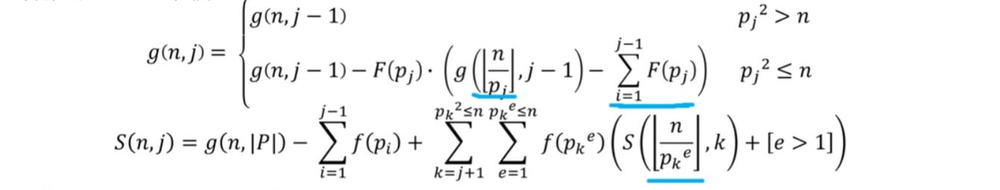

​																


​																			ACM模板
​																								——lovekdl

<div STYLE="page-break-after: always;"></div>


FFT

```c++
#include<bits/stdc++.h>
using namespace std;
const int N = 5e6+10;
struct Complex {
	double x, y;
	Complex(double xx = 0, double yy = 0) : x(xx), y(yy) {}
};
Complex operator + (Complex a, Complex b) {
	return Complex(a.x + b.x, a.y + b.y);
}
Complex operator - (Complex a, Complex b) {
	return Complex(a.x - b.x, a.y - b.y);
}
Complex operator * (Complex a, Complex b) {
	return Complex(a.x * b.x - a.y * b.y, a.x * b.y + b.x * a.y);
}
double pi = acos(-1);
int n, m;
int lim;
Complex F[N], G[N];

void fft(Complex *a, int lim, int opt) {
	if(lim == 1) return;
	Complex a0[lim >> 1], a1[lim >> 1];
	for(int i = 0; i < lim; i += 2) {
		a0[i >> 1] = a[i];
		a1[i >> 1] = a[i + 1];
	}
	fft(a0, lim >> 1, opt);
	fft(a1, lim >> 1, opt);
	Complex w = Complex(1.0, 0); 
	Complex wn = Complex(cos(2.0 * pi / lim), opt * sin(2.0 * pi / lim));
	for(int k = 0; k < (lim >> 1); ++k) {
		Complex t = w * a1[k];
		a[k] = a0[k] + t;
		a[k + (lim >> 1)] = a0[k] - t;
		w = w * wn;
	}
}

void solve() {
	scanf("%d%d", &n, &m);
	for(int i = 0; i <= n; ++i) 
		scanf("%lf", &F[i].x);
	for(int i = 0; i <= m; ++i) {
		scanf("%lf", &G[i].x);
	}
	lim = 1;
	while(lim <= n + m) lim <<= 2;
	fft(F, lim, 1);
	fft(G, lim, 1);
	for(int i = 0; i < lim; ++i) {
		F[i] = F[i] * G[i] % mod;
	}
	fft(F, lim, -1);
	for(int i = 0; i <= n + m; ++i) {
		printf("%d ", (int)(F[i].x / lim + 0.5));
	}
}

int main() {
	solve();
	return 0;
}
```

<div STYLE="page-break-after: always;"></div>


NTT

```C++
#include<bits/stdc++.h>
using namespace std;
typedef long long ll;
const int N = 5e6+10;
const int mod = 998244353, g = 3, gi = 332748118;
//const int mod = 4179340454199820289, g = 3, gi = 1393113484733273430;
int n, m;
ll F[N], G[N];
ll r[N];
int lim = 1, l = 0;

ll qpow(ll a, ll b) {
	ll ret = 1;
	while(b) {
		if(b & 1) ret = ret * a %mod;
		a = a * a % mod;
		b >>= 1;
	}
	return ret;
}

void ntt(ll *a, int opt) {
	for(int i = 0; i < lim; ++i) 
		if(i < r[i]) swap(a[i], a[r[i]]);
	for(int len = 1; len < lim; len <<= 1) {
		ll wn = qpow(opt == 1 ? g : gi, (mod - 1) / (len << 1));
		for(int i = 0; i < lim; i += (len << 1)) {
			ll w = 1;
			for(int j = 0; j < len; ++j) {
				ll x = a[i + j], y = w * a[i + j + len] % mod;
				a[i + j] = (x + y) % mod;
				a[i + j + len] = (x - y + mod) % mod;
				w = w * wn % mod;
			}
		}
	}
}

void solve() {
	scanf("%d%d", &n, &m);
	for(int i = 0; i <= n; ++i) {
		scanf("%d", &F[i]);
	}
	for(int i = 0; i <= m; ++i) {
		scanf("%d", &G[i]);
	}
	while(lim <= n + m) {
		lim <<= 1;
		l++;
	}
	for(int i = 0; i < lim; ++i) {
		r[i] = (r[i >> 1] >> 1) | ((i & 1) << (l - 1));
	}
	ntt(F, 1);
	ntt(G, 1);
	for(int i = 0; i < lim; ++i) {
		F[i] = F[i] * G[i];
	}
	ntt(F, -1);
	ll limv = qpow(lim, mod - 2);
	for(int i = 0; i <= n + m; ++i) {
		printf("%lld ", F[i] * limv % mod);
	}
}

signed main() {
	solve();
	return 0;
}
```

<div STYLE="page-break-after: always;"></div>

分治NTT

```c++
/*
分治ntt
计算f[i] = sum(f[i-j] * g[j])
*/

#include <bits/stdc++.h>
using namespace std;
#define int long long
const int maxn = 2e6+10;
const int mod = 998244353,G = 3,Gi = (mod+1)/3;
int r[maxn], a[maxn], b[maxn], f[maxn], g[maxn],n;
int qpow(int a, int b) {
	int ret = 1;
	while(b) {
		if(b & 1) ret = ret * a % mod;
		a = a * a % mod;
		b >>= 1;
	}
	return ret;
}
void NTT(int *a,int limit,int type) {
	for(int i = 0; i < limit; i++)	
		if(i < r[i]) swap(a[i], a[r[i]]);
	for(int mid = 1; mid < limit; mid <<= 1) {
		int wn = qpow((type == 1 ? G : Gi), (mod - 1) / (mid << 1));
		for(int R = mid << 1, i = 0; i < limit; i += R)
		for(int k = 0, w = 1; k < mid; k++, w = w * wn % mod) {
			int x = a[i+k], y = a[i+k+mid] * w % mod;
			a[i+k] = (x + y) % mod, a[i+k+mid] = (x - y + mod) % mod;
		}
	}
	if(type == 1)	return;
	int inv = qpow(limit, mod-2);
	for(int i = 0;i < limit; i++)	a[i] = a[i] * inv % mod;
}
void mul(int *a, int *b, int limit) {
	for(int i = 0; i < limit; i++)	
		r[i] = (r[i >> 1] >> 1) | ((i & 1) ? limit >> 1 : 0 );
	NTT(a, limit, 1); NTT(b, limit, 1);
	for(int i = 0; i < limit; i++)	a[i] = a[i] * b[i] % mod;
	NTT(a, limit, -1);
}
void solve(int l, int r) {
	if(l == r) return;
	int mid = l + r >> 1; 
	solve(l, mid);
	int limit = 1;
	while(limit <= mid - l + r - l)	limit <<= 1;
	for(int i = 0; i < limit; i++)	a[i] = b[i] = 0;
	for(int i = l; i <= mid; i++)	a[i - l] = f[i];
	for(int i = 1; i <= r - l; i++)	b[i] = g[i];
	mul(a, b, limit);
	for(int i = mid + 1; i <= r; i++)	f[i] = (f[i] + a[i - l])%mod;
	solve(mid+1 , r);
}
signed main() {
	cin >> n;
	for(int i = 1; i < n; i++)	scanf("%lld", &g[i]);
	f[0] = 1;
	solve(0, n-1);
	for(int i = 0; i < n; i++)	printf("%lld ", f[i]);
}
```

<div STYLE="page-break-after: always;"></div>

拉格朗日插值

```c++
#include<bits/stdc++.h>
#define int long long
using namespace std;
const int N = 1e4+10;
const int mod = 998244353;
int T;
int n, k;
int x[N], y[N];

int qpow(int a, int b) {
	int ret = 1;
	while(b) {
		if(b & 1) ret = ret * a % mod;
		a = a * a % mod;
		b >>= 1;
	}
	return ret;
}

int lagrange(int k) {
	int ans = 0;
	for(int i = 1; i <= n; ++i) {
		int now = y[i];
		for(int j = 1; j <= n; ++j) {
			if(j == i) continue;
			now = now * (k - x[j]) % mod * qpow(x[i] - x[j], mod - 2) %mod;
		}
		ans = (ans + now) % mod;
	}
	if(ans < 0) ans += mod;
	return ans;
}
```

<div STYLE="page-break-after: always;"></div>

<div STYLE="page-break-after: always;"></div>

exgcd

```c++
int exgcd(int a, int b, int &x, int &y) {
    if (b == 0) {
        x = 1;
        y = 0;
        return a;
    }
    int d = exgcd(b, a % b, y, x);
    y -= (a / b) * x;
    return d;
}
```

合并两个同余方程(CRT)

```c++
void merge(ll &a, ll &b, ll c, ll d) { 
    if (a == -1 && b == -1) return;
    ll x, y;
    ll g = exgcd(b, d, x, y);
    if ((c - a) % g != 0) {
        a = b = -1;
        return;
    }
    d /= g;
    ll t0 = ((c - a) / g) % d * x % d;
    if (t0 < 0) t0 += d;
    a = b * t0 + a;
    b = b * d;
}
```

<div STYLE="page-break-after: always;"></div>

莫比乌斯反演
$$
f[n] = {∑_{d|n}}g(d) 求g(n)
$$


```c++
#include<bits/stdc++.h>
#define uint unsigned int 
using namespace std;
typedef long long ll;
const int N = 1e6+101;
uint f[N];
int n;
int p[N], pr[N], pe[N];
int cnt;
uint mu[N];
uint g[N];
unsigned int A,B,C;
void solve() {
	scanf("%d", &n);
    for (int i = 1; i <= n; i++)
        cin>>f[i];
    p[1] = 1;mu[1] = 1;
    for(int i = 2; i <= n; ++i) {
    	if(!p[i]) {
    		p[i] = i;
    		pr[++cnt] = i;
    		mu[i] = (uint)-1;
    	}
    	for(int j = 1; j <= cnt && i * pr[j] <= n; ++j) {
    		p[i * pr[j]] = pr[j];
    		if(p[i] == pr[j]) {
    			mu[i * pr[j]] = 0;
    			break;
    		}
    		else mu[i * pr[j]] = (uint) -mu[i];
    	}
    }
    for(int d1 = 1; d1 <= n; ++d1) 
    	for(int d2 = 1; d2 * d1 <= n; ++d2) 
    		g[d1 * d2] += f[d1] * mu[d2];
}
int main() {
	solve();
	return 0;
}
```


<div STYLE="page-break-after: always;"></div>

求积性函数

```c++
void compute(function<void(int)> calc) {
	f[1] = 1;
	uint ans = 0;
	for(int i = 2; i <= n; ++i) {
		if(i == pe[i]) calc(i);
		else f[i] = f[i / pe[i]] * f[pe[i]];
		ans = ans ^ (a * i * f[i] + b);
	}
	ans = ans ^ (a + b);
	printf("%u\n", ans);
}

void solve() {
	scanf("%d%u%u", &n, &a, &b);
	for(int i = 2; i <= n; ++i) {
		if(!p[i]) {
			p[i] = i;
			pe[i] = i;
			pr[++cnt] = i;
		}
		for(int j = 1; j <= cnt && i * pr[j] <= n; ++j) {
			p[i * pr[j]] = pr[j];
			if(p[i] == pr[j]) {
				pe[i * pr[j]] = pe[i] * pr[j];
				break;
			}
			else {
				pe[i * pr[j]] = pr[j];
			}
		}
}    
```

<div STYLE="page-break-after: always;"></div>

O($\sqrt{n}$)求$\sum_{i=1}^n{gcd(i,n)}$
积性函数，$g(p^a) = (a+1)p^a - ap^{a-1}$

```c++
#include<bits/stdc++.h>
#define int long long
using namespace std;
int g(int n){
	int ans = 1;
	for(int i=2;i*i<=n;++i){
		if(n%i) continue;
        int a=0;
        int p=1;
        while(n%i==0) {
            p *= i;
            ++a;
            n /= i;
        }
        ans *= (a+1)*p - p/i*a;
	}
	if(n>1){
		ans *= n+n-1;
	}
	return ans;
}

signed main(){
	int n;
	cin >> n;
	cout << g(n) << endl;
	return 0;
}
```


<div STYLE="page-break-after: always;"></div>

tarjan缩点

```c++
#include<bits/stdc++.h>
#define int long long 
using namespace std;
const int maxn = 1e5+100;
int n, m;
int num, ans;
int w[maxn];
int dfn[maxn], low[maxn], vis[maxn];
int belong[maxn], in[maxn], f[maxn];
struct Edge {
	int next[maxn], to[maxn], from[maxn];
	int head[maxn], cnt;
	void con(int u, int v) {
		next[++cnt] = head[u];
		to[cnt] = v;
		from[cnt] = u;
		head[u] = cnt;
	}
}ED1, ED2;
stack <int> stu;
void tarjan(int x) {
	low[x] = dfn[x] = ++num;
	vis[x] = 1;
	stu.push(x);
	for(int i = ED1.head[x]; i; i = ED1.next[i]) {
		int v = ED1.to[i];
		if(!dfn[v]) {
			tarjan(v);
			low[x] = min(low[x], low[v]);
		}
		if(vis[v])
			low[x] = min(low[x], low[v]);
	}
	if(dfn[x] == low[x]) {
		while(stu.top() != x) {
			int y = stu.top();
			stu.pop();
			belong[y] = x;
			w[x] += w[y];
			vis[y] = 0;
		}
		belong[x] = x;
		vis[x] = 0;
		stu.pop();
	}
}
signed main() {
	cin>>n>>m;
	for(int i = 1; i <= n; ++i)
		scanf("%lld", &w[i]);
	for(int i = 1; i <= m; ++i) {
		int u, v;
		scanf("%lld%lld", &u, &v);
		ED1.con(u, v);
	}
	for(int i = 1; i <= n; ++i) {
		if(!dfn[i]) tarjan(i);
	}
	for(int i = 1; i <= m; ++i) {
		int u = belong[ED1.from[i]], v = belong[ED1.to[i]];
		if(u == v) continue;
		++in[v];
		ED2.con(u, v);
	}
    //topo
	return 0;
}
```

<div STYLE="page-break-after: always;"></div>

线性基

```c++
typedef long long ll;
const int N = 60;
bool flag;
ll a[N + 1],tmp[N + 1];

void Insert(ll x){
    for(int i = N;~i;i--)
        if(x & (1ll << i))//强转成 long long（因为x是ll）
            if(!a[i])
                {a[i] = x;return ;}
            else x ^= a[i];
    flag = true;//表示线性基里至少有一个
}

bool check(ll x){

    for(int i = N;~i;i--)
        if(x & (1ll << i))
            if(!a[i])
                return false;
            else x ^= a[i];
    return true;
}

ll qmax(ll res = 0){

    for(int i = N;~i;i--)
        res = max(res,res ^ a[i]);
    return res;
}

ll qmin(){
    if(flag)return 0;
    for(int i = 0;i <= N;++i)//找最小值从低位到高位
        if(a[i])return a[i];
}

ll query(ll k){
    ll res = 0;
    int cnt = 0;
    k -= flag;//因为是从第0位开始的，有元素的话就-1
    if(!k)return 0;
    for(int i = 0;i <= N;++i){
        for(int j = i - 1;~j;j--)
            if(a[i] & (1ll << j))
                a[i] ^= a[j];
        if(a[i])tmp[cnt++] = a[i];
    }
    if(k >= (1ll << cnt))return -1;
    for(int i = 0;i < cnt;++i)
        if(k & (1ll << i))res ^= tmp[i];
    return res;
}
int n;
ll x;
int main(){

    scanf("%d",&n);
    for(int i = 1;i <= n;++i)
        scanf("%lld",&x),Insert(x);
    printf("%lld\n",qmax());
    return 0;
}


```


<div STYLE="page-break-after: always;"></div>

虚树

```c++
#include<bits/stdc++.h>
#define int long long
#define PII pair<int, int>
using namespace std;
const int N = 3e5 + 1010;
const int inf = 1ll<< 60;
int n, m, k;
int x[N],tot;
int w[N], va[N], dep[N], minp[N], dfn[N], cnt;
int lc[N][19];
vector<PII> e[N];
vector<int> e1[N];

void dfs1(int x, int fa) {
	dfn[x] = ++tot;
	dep[x] = dep[fa] + 1;
	lc[x][0] = fa;
	for(auto t : e[x]) {
		int v = t.first;
		if(v == fa) continue;
		minp[v] = min(minp[x], t.second);
		dfs1(v, x);
	}
}
bool cmp(int a, int b) {
	return dfn[a] < dfn[b];
}
int lca(int x, int y) {
	int flag = 0;
	if(x == 8 && y == 3) {
		flag = 1;
	}
	if(dep[x] < dep[y]) swap(x, y);
	for(int j = 18; j >= 0; --j) {
		if(dep[lc[x][j]] >= dep[y]) {
			x = lc[x][j];
		}
	}
	
	if(x == y) return x;
	for(int j = 18; j >= 0; --j) {
		if(lc[x][j] == lc[y][j]) continue;
		x = lc[x][j];
		y = lc[y][j];
	}
	return lc[x][0];
}
void con(int x, int y) {
	e1[x].push_back(y);
	e1[y].push_back(x);
}
int stac[N], top = 0;
//建树
void build() {
	sort(w + 1, w + 1 + k, cmp);
	top = 0;
	stac[++top] = w[1];
	for(int i = 2; i <= k; ++i) {
		int lc = lca(stac[top], w[i]);
		while(dep[stac[top - 1]] >= dep[lc])	 {
			con(stac[top], stac[top - 1]);
			top--;
		}
		if(stac[top] != lc) {
			con(lc, stac[top]);
			stac[top] = lc;
		}
		stac[++top] = w[i];
	}
	for(int i = top; i >= 2; --i) {
		con(stac[i], stac[i - 1]);
	}
}
//dp
int dfs(int x, int fa) {
	int now = 0;
	for(auto v : e1[x]) {
		if(v == fa) continue;
		now += dfs(v, x);
	}
	//记得清除虚树
	e1[x].clear();
	if(va[x]) {
		va[x] = 0;
		return minp[x];
	}
	else return min(now, minp[x]);
}
void solve() {
	cin>>n;
	for(int i = 1, u, v, d; i < n; ++i) {
		cin>>u>>v>>d;
		e[u].push_back({v, d});
		e[v].push_back({u, d});
	}

	for(int i = 1; i <= n; ++i) minp[i] = inf;
	minp[1] = inf;
	dfs1(1, 0);
	for(int j = 1; j <= 18; ++j) {
		for(int i = 1; i <= n; ++i) {
			lc[i][j] = lc[lc[i][j-1]][j-1];
		}
	}
	cin>>m;
	for(int i = 1; i <= m; ++i) {
		cin>>k;
		for(int i = 1; i <= k; ++i) {
			cin>>w[i];
			va[w[i]] = 1;
		}
		build();
		cout<<dfs(stac[1], 0)<<endl;
	}
}

signed main() {
	ios::sync_with_stdio(false);
	cin.tie(nullptr);

	solve();
	return 0;
}
```


<div STYLE="page-break-after: always;"></div>

树上背包

```c++
#include<bits/stdc++.h>
using namespace std;
typedef long long ll;
const int N = 3030;
const ll inf = 1<<29;
int n, q;
int fa[N], a[N], sz[N];
ll f[N][N], tmp[N];
vector<int> e[N];

void dfs(int x) {
	sz[x] = 1;
	for(auto v : e[x]) 
		dfs(v);
	f[x][1] = a[x];
	for(auto v : e[x]) {
		for(int i = 1; i <= sz[x] + sz[v]; ++i) tmp[i] = -inf;
		for(int i = 1; i <= sz[x]; ++i)
			for(int j = 0; j <= sz[v]; ++j) 
				tmp[i + j] = max(tmp[i + j], f[x][i] + f[v][j]);
		for(int i = 1; i <= sz[x] + sz[v]; ++i) 
			f[x][i] = tmp[i];
		sz[x] += sz[v];
	}
}
int main() {
	scanf("%d%d", &n, &q);
	for (int i = 2; i <= n; ++i) {
		scanf("%d", &fa[i]);
		e[fa[i]].push_back(i);
	}
	for(int i = 1; i <= n; ++i) scanf("%d", &a[i]);
	dfs(1);
	for(int i = 1, u, m; i <= q; ++i) {
		scanf("%d%d", &u, &m);
		printf("%lld\n", f[u][m]);
	}
	return 0;
}
```

<div STYLE="page-break-after: always;"></div>

区间合并、区间求交

```c++
void merge(vector<PII> &segs) {
    if (segs.empty()) return;
    vector<PII> res;
    sort(segs.begin(), segs.end());
    int st = segs[0].l, ed = segs[0].r;
    for (auto seg : segs) {
        if (seg.l > ed) {
            res.push_back({st, ed});
            st = seg.l, ed = seg.r;
        } 
        else ed = max(ed, seg.r);
    }
    res.push_back({st, ed});
    segs = res;
}

vector<PII> intersection(vector<PII> a, vector<PII> b) {
    vector<PII> res;
    int i = 0, j = 0;
    while (i < a.size() && j < b.size()) {
        int l = max(a[i].l, b[j].l);
        int r = min(a[i].r, b[j].r);
        if (l <= r) res.push_back({l, r});
        if (a[i].r < b[j].r) i++;
        else j++;
    }
    return res;
}
```

极角排序

```cpp
using Points = vector<Point>;
double theta(auto p) { return atan2(p.y, p.x); } // 求极角
void psort(Points &ps, Point c = O)              // 极角排序
{
    sort(ps.begin(), ps.end(), [&](auto p1, auto p2) {
        return lt(theta(p1 - c), theta(p2 - c));
    });
}
```


<div STYLE="page-break-after: always;"></div>

子集反演


```cpp
#include<bits/stdc++.h>
#define int long long
using namespace std;
const int N = 520;
const int mod = 1e9 + 7;
int n;
int a[N][N];
int sum[1 << 20];
vector<pair<int, int>> road[N];
int po[N], cnt;

void clear() {
	for(int i = 1; i <= n + 1; ++i) 
		for(int j = 1; j <= n + 1; ++j) a[i][j] = 0;
}

void con(int u, int v) {
	a[u][u]++;
	a[v][v]++;
	a[u][v]--;
	a[v][u]--;
}

void add() {
	for(int i = 1; i <= cnt; ++i) {
		for(auto x : road[po[i]]) {
			con(x.first, x.second);
		}
	}
}

int work() {
	int w = n;
	int ret = 1;/*
	for(int i = 1; i <= w; ++i) {
		for(int j = 1; j <= w; ++j) cout<<a[i][j]<<" ";
			cout<<endl;
	}
	cout<<endl;*/
	for(int i = 1; i <= w; ++i) {
		for(int j = i + 1; j <= w; ++j) {
			while(a[j][i]) {
				int l = a[i][i] / a[j][i];
				for(int k = i; k <= w; ++k) 
					a[i][k] = (a[i][k] - l * a[j][k] % mod + mod) % mod;
				for(int k = i; k <= w; ++k) 
					swap(a[i][k], a[j][k]);
				ret = ret * -1;
			}
		}
	}
	for(int i = 1; i <= w; ++i) {
		ret = (ret * a[i][i] % mod + mod) % mod;
	}
	
	return ret;
}

void solve() {
	cin>>n;
	for(int i = 1, x; i < n; ++i) {
		cin>>x;
		for(int j = 1, u, v; j <= x; ++j) {
			cin>>u>>v;
			road[i].push_back({u, v});
		}
	}
	
	n--;
	int maxn = (1 << n) - 1;
	int ans = 0;
	for(int i = 0; i <= maxn; ++i) {
		sum[i] = sum[i>>1] + (i & 1);
		cnt = 0;
		for(int j = 0; j <= 20; ++j) {
			if(i & (1 << j)) po[++cnt] = j + 1;
		}
		clear();
		add();
		int f = work();
		//cout<<((n - sum[i]) % 2 ? -1 : 1) * f<<endl;
		ans =  (ans + ((n - sum[i]) % 2 ? -1 : 1) * f % mod + mod) % mod;
	}
	cout<<ans;
}

signed main() {
	ios::sync_with_stdio(false);
	cin.tie(NULL);
	solve();
	return 0;
}
```

<div STYLE="page-break-after: always;"></div>

子集dp

```c++
for(int i=0;i<w;++i)//依次枚举每个维度{
    for(int j=0;j<(1<<w);++j)//求每个维度的前缀和{
        if(j&(1<<i))s[j]+=s[j^(1<<i)]; 
    }
}
```


<div STYLE="page-break-after: always;"></div>

min25筛




```cpp
#include<bits/stdc++.h>
#define int long long
using namespace std;
typedef long long ll;
const int N = 1e6 + 1010, mod = 1e9 + 7;
int n;

int ksm(int a, int b) {
	int ret = 1;
	while(b) {
		if(b & 1) ret = ret * a % mod;
		a = a * a % mod;
		b >>= 1;
	}
	return ret;
}


namespace min25 {
	int sq;
	int g1[N], g2[N], w[N], id1[N], id2[N], tot;
	int p[N], pr[N], cnt;
	int sp1[N], sp2[N];
	int inv2, inv6;
	void init() {
		sq = sqrt(n);
		cnt = 0;
		inv2 = ksm(2, mod - 2), inv6 = ksm(6, mod - 2);
		for(int i = 2; i <= sq; ++i) {
			if(!p[i]) {
				p[i] = pr[++cnt] = i;
				sp1[cnt] = (sp1[cnt - 1] + i) % mod;
				sp2[cnt] = (sp2[cnt - 1] + i*i%mod) % mod;
			}
			for(int j = 1; j <= cnt && i * pr[j] <= sq; ++j) {
				p[i * pr[j]] = pr[j];
				if(p[i] == pr[j]) break;
			}
		}
	}
	void getG() {
		for(ll l = 1, r; l <= n; l = r + 1) {
			r = n / (n / l);
			int x = n / l ;
			w[++tot] = x;
			x %= mod;
			g1[tot] = (x * (x + 1)%mod * inv2 % mod - 1+ mod)% mod;
			g2[tot] = (x * (x + 1)%mod * (x * 2 + 1)% mod * inv6%mod - 1 + mod) % mod;
			
			w[tot] <= sq ? id1[w[tot]] = tot : id2[n / w[tot]] = tot;
		}
		for(int j = 1; j <= cnt; ++j) {
			for(int i = 1; i <= tot && pr[j] * pr[j] <= w[i]; ++i) {
				int tmp = w[i] / pr[j];
				int p = tmp <= sq? id1[tmp] : id2[n / tmp];
				g1[i] = (g1[i] - pr[j] * (g1[p] - sp1[j - 1] + mod) % mod + mod) % mod;
				g2[i] = (g2[i] - pr[j] * pr[j] %mod * (g2[p] - sp2[j - 1] + mod) % mod + mod) % mod;
			}
		}
	}
	int getS(int i, int j) {
		if(pr[j] >= i) return 0;
		int p = i <= sq? id1[i] : id2[n / i];
		int ans = ((g2[p] - g1[p] + mod) % mod - (sp2[j] - sp1[j] + mod) % mod + mod) % mod;
		for(int k = j + 1; pr[k] * pr[k] <= i && k <= cnt; ++k) {
			int pe = pr[k];
			for(int e = 1; pe <= i; ++e, pe = pe * pr[k]) {
				int x = pe % mod;
				ans = (ans + x * (x - 1) % mod * (getS(i / pe, k) + (e > 1)) % mod) % mod;
			}
		}
		return ans;
	}
	int getans(ll n) {
		init();
		getG();
		
		return getS(n, 0) + 1; 
	}
}

signed main() {
	scanf("%lld", &n);
	printf("%lld", min25::getans(n));
	return 0;
}
```

<div STYLE="page-break-after: always;"></div>

杜教筛


```cpp
#include<bits/stdc++.h>
#define int long long
using namespace std;
typedef long long ll;
const int N = 5e6 + 1010;
ll T;
ll sphi[N], smu[N];
ll n;
int p[N], pr[N], cnt;
int mu[N], phi[N];
map<ll, ll> mpphi;
map<ll, ll> mpmu;
void init() {
	for(int i = 2; i < N; ++i) {
		if(!p[i]) {
			p[i] = i;
			pr[++cnt] = i;
			mu[i] = -1;
			phi[i] = i - 1;
		}
		for(int j = 1; j <= cnt && i * pr[j] < N; ++j) {
			p[i * pr[j]] = pr[j];
			if(p[i] == pr[j]) {
				mu[i * pr[j]] = 0;
				phi[i * pr[j]] = phi[i] * pr[j];
				break;
			}
			else {
				mu[i * pr[j]] = -mu[i];
				phi[i * pr[j]] = phi[i] * (pr[j] - 1);
			}
		}
	}
	mu[1] = 1;
	phi[1] = 1;
	for(int i = 1; i < N; ++i) {
		smu[i] = smu[i - 1] + mu[i];
		sphi[i] = sphi[i - 1] + phi[i]; 
	}
}
ll getphi(int n) {
	if(n < N) return sphi[n];
	if(mpphi.count(n)) return mpphi[n];
	ll sum = (ll)(1 + n) * n / 2;
	for(int l = 2; l <= n; ++l) {
		int r = n / (n / l);
		sum -= (ll)(r - l + 1) * getphi(n / l);
		l = r;
	}
	return mpphi[n] = sum;
}
ll getmu(int n) {
	if(n < N) return smu[n];
	if(mpmu.count(n)) return mpmu[n];
	ll sum = 1;
	for(int l = 2; l <= n; ++l) {
		int r = n / (n / l);
		sum -= (ll)(r - l + 1) * getmu(n / l);
		l = r;
	}
	return mpmu[n] = sum;
}
signed main() {
	init();
	scanf("%lld", &T);
	while(T--) {
		scanf("%lld", &n);
		printf("%lld %lld\n", getphi(n), getmu(n));
	}
	return 0;
}
```

<div STYLE="page-break-after: always;"></div>

卢卡斯定理

```cpp
ll lucas(int n,int m,int p){
	if(m==0) return 1;
	return lucas(n/p,m/p,p)*C(n%p,m%p)%p;
}
```

卡特兰数


prufer序列

一个长度为n-2的Prufer序列，唯一对应一棵n个点固定形态的无根树。

性质：

1. prufer序列中，点u出现的次数，等于点u在树中的度数-1
2. n个点的无根树，唯一对应长度为n-2的prufer序列，序列每个数都在1到n的范围内。
3. Cayley定理：n个点的无向完全图的生成树的计数: $n^{n-2}$，即n个点的有标号无根树的计数
4. n个节点的度依次为的无根树共有!}-1681731226876-10.gif)个，因为此时Prufer编码中的数字i恰好出现di−1次，(n−2)!是总排列数
5. n个点的有标号有根树的计数：


矩阵树定理


二项式反演（3个形式）


第一类斯特林数

*n*个不同元素构成*m*个圆的排列方案数

​		

第二类斯特林数

*n*个不同元素构成*m*个集合的排列方案数

​																	$S(n,m)=S(n−1,m−1)+m\times S(n−1,m)$


下降幂


贝尔数


```c++
void init()
{
    vis.clear();
    b.clear();
    a[1][1]=1;
    for(int i=2;i<=p;++i) for(int j=1;j<=i;++j) {
        if(j==1) a[i][j]=a[i-1][i-1];
        else {
            a[i][j]=(a[i][j-1]+a[i-1][j-1])%p;
        }
    }
}

int get_ans(int x)
{
    if(x<=p) {
        return a[x][0];
    }
    if(vis[x]) return b[x];
    vis[x]=1;
    return b[x]=(get_ans(x-p)+get_ans(x-p+1))%p;

```

多项式全家桶 + bell数

```c++
#include <bits/stdc++.h>
using namespace std;
using i64 = long long;
constexpr int mod = 998244353;
int norm(int x) {
    if (x < 0) {
        x += mod;
    }
    if (x >= mod) {
        x -= mod;
    }
    return x;
}
template<class T>
T power(T a, int b) {
    T res = 1;
    for (; b; b /= 2, a *= a) {
        if (b % 2) {
            res *= a;
        }
    }
    return res;
}
struct Z {
    int x;
    Z(int x = 0) : x(norm(x)) {}
    int val() const {
        return x;
    }
    Z operator-() const {
        return Z(norm(mod - x));
    }
    Z inv() const {
        assert(x != 0);
        return power(*this, mod - 2);
    }
    Z &operator*=(const Z &rhs) {
        x = i64(x) * rhs.x % mod;
        return *this;
    }
    Z &operator+=(const Z &rhs) {
        x = norm(x + rhs.x);
        return *this;
    }
    Z &operator-=(const Z &rhs) {
        x = norm(x - rhs.x);
        return *this;
    }
    Z &operator/=(const Z &rhs) {
        return *this *= rhs.inv();
    }
    friend Z operator*(const Z &lhs, const Z &rhs) {
        Z res = lhs;
        res *= rhs;
        return res;
    }
    friend Z operator+(const Z &lhs, const Z &rhs) {
        Z res = lhs;
        res += rhs;
        return res;
    }
    friend Z operator-(const Z &lhs, const Z &rhs) {
        Z res = lhs;
        res -= rhs;
        return res;
    }
    friend Z operator/(const Z &lhs, const Z &rhs) {
        Z res = lhs;
        res /= rhs;
        return res;
    }
    friend istream &operator>>(istream &is, Z &a) {
        i64 v;
        is >> v;
        a = Z(v);
        return is;
    }
    friend ostream &operator<<(ostream &os, const Z &a) {
        return os << a.val();
    }
};
vector<int> rev;
vector<Z> roots{0, 1};
void dft(vector<Z> &a) {
    int n = a.size();
    if (int(rev.size()) != n) {
        int k = __builtin_ctz(n) - 1;
        rev.resize(n);
        for (int i = 0; i < n; i ++) {
            rev[i] = rev[i >> 1] >> 1 | (i & 1) << k;
        }
    }
    for (int i = 0; i < n; i ++) {
        if (rev[i] < i) {
            swap(a[i], a[rev[i]]);
        }
    }
    if (int(roots.size()) < n) {
        int k = __builtin_ctz(roots.size());
        roots.resize(n);
        while ((1 << k) < n) {
            Z e = power(Z(3), (mod - 1) >> (k + 1));
            for (int i = 1 << (k - 1); i < (1 << k); i ++) {
                roots[i << 1] = roots[i];
                roots[i << 1 | 1] = roots[i] * e;
            }
            k ++;
        }
    }
    for (int k = 1; k < n; k *= 2) {
        for (int i = 0; i < n; i += 2 * k) {
            for (int j = 0; j < k; j ++) {
                Z u = a[i + j], v = a[i + j + k] * roots[k + j];
                a[i + j] = u + v, a[i + j + k] = u - v;
            }
        }
    }
}
void idft(vector<Z> &a) {
    int n = a.size();
    reverse(a.begin() + 1, a.end());
    dft(a);
    Z inv = (1 - mod) / n;
    for (int i = 0; i < n; i ++) {
        a[i] *= inv;
    }
}
struct Poly {
    vector<Z> a;
    Poly() {}
    Poly(const vector<Z> &a) : a(a) {}
    Poly(const initializer_list<Z> &a) : a(a) {}
    int size() const {
        return a.size();
    }
    void resize(int n) {
        a.resize(n);
    }
    Z operator[](int idx) const {
        if (idx < size()) {
            return a[idx];
        } else {
            return 0;
        }
    }
    Z &operator[](int idx) {
        return a[idx];
    }
    Poly mulxk(int k) const {
        auto b = a;
        b.insert(b.begin(), k, 0);
        return Poly(b);
    }
    Poly modxk(int k) const {
        k = min(k, size());
        return Poly(vector<Z>(a.begin(), a.begin() + k));
    }
    Poly divxk(int k) const {
        if (size() <= k) {
            return Poly();
        }
        return Poly(vector<Z>(a.begin() + k, a.end()));
    }
    friend Poly operator+(const Poly &a, const Poly &b) {
        vector<Z> res(max(a.size(), b.size()));
        for (int i = 0; i < int(res.size()); i ++) {
            res[i] = a[i] + b[i];
        }
        return Poly(res);
    }
    friend Poly operator-(const Poly &a, const Poly &b) {
        vector<Z> res(max(a.size(), b.size()));
        for (int i = 0; i < int(res.size()); i ++) {
            res[i] = a[i] - b[i];
        }
        return Poly(res);
    }
    friend Poly operator*(Poly a, Poly b) {
        if (a.size() == 0 || b.size() == 0) {
            return Poly();
        }
        int sz = 1, tot = a.size() + b.size() - 1;
        while (sz < tot) {
            sz *= 2;
        }
        a.a.resize(sz);
        b.a.resize(sz);
        dft(a.a);
        dft(b.a);
        for (int i = 0; i < sz; i ++) {
            a.a[i] = a[i] * b[i];
        }
        idft(a.a);
        a.resize(tot);
        return a;
    }
    friend Poly operator*(Z a, Poly b) {
        for (int i = 0; i < int(b.size()); i ++) {
            b[i] *= a;
        }
        return b;
    }
    friend Poly operator*(Poly a, Z b) {
        for (int i = 0; i < int(a.size()); i ++) {
            a[i] *= b;
        }
        return a;
    }
    Poly &operator+=(Poly b) {
        return (*this) = (*this) + b;
    }
    Poly &operator-=(Poly b) {
        return (*this) = (*this) - b;
    }
    Poly &operator*=(Poly b) {
        return (*this) = (*this) * b;
    }
    Poly deriv() const {
        if (a.empty()) {
            return Poly();
        }
        vector<Z> res(size() - 1);
        for (int i = 0; i < size() - 1; i ++) {
            res[i] = (i + 1) * a[i + 1];
        }
        return Poly(res);
    }
    Poly integr() const {
        vector<Z> res(size() + 1);
        for (int i = 0; i < size(); i ++) {
            res[i + 1] = a[i] / (i + 1);
        }
        return Poly(res);
    }
    Poly inv(int m) const {
        Poly x{a[0].inv()};
        int k = 1;
        while (k < m) {
            k *= 2;
            x = (x * (Poly{2} - modxk(k) * x)).modxk(k);
        }
        return x.modxk(m);
    }
    Poly log(int m) const {
        return (deriv() * inv(m)).integr().modxk(m);
    }
    Poly exp(int m) const {
        Poly x{1};
        int k = 1;
        while (k < m) {
            k *= 2;
            x = (x * (Poly{1} - x.log(k) + modxk(k))).modxk(k);
        }
        return x.modxk(m);
    }
    Poly pow(int k, int m) const {
        int i = 0;
        while (i < size() && a[i].val() == 0) {
            i ++;
        }
        if (i == size() || 1LL * i * k >= m) {
            return Poly(vector<Z>(m));
        }
        Z v = a[i];
        auto f = divxk(i) * v.inv();
        return (f.log(m - i * k) * k).exp(m - i * k).mulxk(i * k) * power(v, k);
    }
    Poly sqrt(int m) const {
        Poly x{1};
        int k = 1;
        while (k < m) {
            k *= 2;
            x = (x + (modxk(k) * x.inv(k)).modxk(k)) * ((mod + 1) / 2);
        }
        return x.modxk(m);
    }
    Poly mulT(Poly b) const {
        if (b.size() == 0) {
            return Poly();
        }
        int n = b.size();
        reverse(b.a.begin(), b.a.end());
        return ((*this) * b).divxk(n - 1);
    }
};
vector<Z> fact, infact, f;
Poly bell;
void init(int n) {
    fact.resize(n + 1), infact.resize(n + 1), f.resize(n + 1);
    fact[0] = infact[0] = 1;
    for (int i = 1; i <= n; i ++) {
        fact[i] = fact[i - 1] * i;
    }
    infact[n] = fact[n].inv();
    for (int i = n; i; i --) {
        infact[i - 1] = infact[i] * i;
    }
    for (int i = 1; i <= n; i ++) {
        f[i] = infact[i];
    }
    bell = Poly(f).exp(n + 1);
    for (int i = 1; i <= n; i ++) {
    	bell[i] *= fact[i];
    }
}
void solve() {
	int n;
	cin >> n;
	Z res;
	for (int i = 0; i <= n; i ++) {
		int x;
		cin >> x;
		res += bell[i] * x;
	}
	cout << res << "\n";
}
signed main() {
    init(1e5);
    cin.tie(0) -> sync_with_stdio(0);
    int T;
    cin >> T;
    while (T --) {
        solve();
    }
}
```
